# Creación de esquemas de metadatos — Una guía para data stewards

**Contour** te permite diseñar esquemas de metadatos personalizados de forma
visual —arrastrando o haciendo clic en widgets de formulario sobre un lienzo— y
los exporta como formas [SHACL](https://www.w3.org/TR/shacl/) conformes con los
estándares, con anotaciones de formulario [DASH](https://datashapes.org/forms.html).
El resultado encaja directamente en un
[FAIR Data Point](https://fairdatapoint.org/) o en cualquier plataforma
compatible con SHACL.

> *Eslogan de Contour: **Visual schemas. Clean SHACL.***

Esta guía está pensada para **data stewards** que quieran definir qué metadatos
debe (o puede) aportar su comunidad para un tipo determinado de recurso —un
conjunto de datos, un estudio, una muestra, un paquete de software— sin escribir
Turtle a mano.

> **Sin instalación, sin servidor.** El editor es una única página web
> autocontenida. Ábrela en Chrome o Edge (recomendado, para guardar archivos
> directamente) — Firefox y Safari también funcionan, con un guardado en forma
> de descarga.

---

## Índice

1. [Qué estás creando (conceptos clave)](#1-qué-estás-creando-conceptos-clave)
2. [La interfaz de un vistazo](#2-la-interfaz-de-un-vistazo)
3. [Tutorial: crear un esquema *Dataset* desde cero](#3-tutorial-crear-un-esquema-dataset-desde-cero)
   - [Paso 1 — Definir la identidad del esquema](#paso-1--definir-la-identidad-del-esquema)
   - [Paso 2 — Gestionar vocabularios (prefijos)](#paso-2--gestionar-vocabularios-prefijos)
   - [Paso 3 — Organizar el formulario en grupos](#paso-3--organizar-el-formulario-en-grupos)
   - [Paso 4 — Añadir tu primera propiedad (un campo de texto)](#paso-4--añadir-tu-primera-propiedad-un-campo-de-texto)
   - [Paso 5 — Establecer la cardinalidad y las restricciones de validación](#paso-5--establecer-la-cardinalidad-y-las-restricciones-de-validación)
   - [Paso 6 — Añadir una descripción de varias líneas](#paso-6--añadir-una-descripción-de-varias-líneas)
   - [Paso 7 — Añadir una propiedad de fecha](#paso-7--añadir-una-propiedad-de-fecha)
   - [Paso 8 — Añadir un vocabulario controlado (enumeración)](#paso-8--añadir-un-vocabulario-controlado-enumeración)
   - [Paso 9 — Referenciar otra entidad (IRI + clase)](#paso-9--referenciar-otra-entidad-iri--clase)
   - [Paso 10 — Modelar un subobjeto con una forma anidada](#paso-10--modelar-un-subobjeto-con-una-forma-anidada)
   - [Paso 11 — Previsualizar el formulario de entrada de datos](#paso-11--previsualizar-el-formulario-de-entrada-de-datos)
   - [Paso 12 — Revisar el SHACL generado](#paso-12--revisar-el-shacl-generado)
   - [Paso 13 — Guardar y exportar](#paso-13--guardar-y-exportar)
4. [Trabajar directamente con el código (la pestaña Código SHACL)](#4-trabajar-directamente-con-el-código-la-pestaña-código-shacl)
   - [Elegir una sintaxis (y exportar JSON-LD)](#elegir-una-sintaxis-y-exportar-json-ld)
   - [Editar un esquema existente es sin pérdidas](#editar-un-esquema-existente-es-sin-pérdidas)
   - [Visualizar el grafo](#visualizar-el-grafo)
5. [Comprobar tu trabajo (el panel de Problemas)](#5-comprobar-tu-trabajo-el-panel-de-problemas)
6. [Funciones avanzadas (modelado avanzado)](#6-funciones-avanzadas-modelado-avanzado)
7. [Referencia](#7-referencia)
   - [Catálogo de widgets](#catálogo-de-widgets)
   - [Referencia de los ajustes de propiedad](#referencia-de-los-ajustes-de-propiedad)
8. [Recetas — patrones de modelado habituales](#8-recetas--patrones-de-modelado-habituales)
9. [Consejos y resolución de problemas](#9-consejos-y-resolución-de-problemas)

---

## 1. Qué estás creando (conceptos clave)

Un esquema de metadatos en esta herramienta es una **NodeShape SHACL**: la
descripción de cómo es un registro válido de un tipo determinado. Algunos
términos que encontrarás a lo largo de la guía:

| Término | Qué significa para ti |
|---|---|
| **NodeShape** | El esquema en sí — p. ej., "qué debe contener un registro de Dataset". |
| **Clase objetivo** (`sh:targetClass`) | El tipo RDF al que se aplica el esquema, p. ej., `dcat:Dataset`. Los registros de este tipo se validan frente a tu esquema. |
| **Propiedad** (`sh:property`) | Un único campo — título, editor, fecha de emisión… Cada propiedad tiene una *ruta*, un *widget* y *restricciones*. |
| **Ruta de propiedad** (`sh:path`) | El predicado RDF en el que escribe el campo, p. ej., `dct:title`. Es el término que realmente se almacena en los metadatos. |
| **Widget** (`dash:editor`) | El control de formulario que se muestra a quien rellena los metadatos — una caja de texto, un selector de fecha, una lista desplegable, etc. |
| **Grupo** (`sh:PropertyGroup`) | Una sección visual que agrupa campos relacionados, p. ej., "Información general". |
| **Prefijo** (`@prefix`) | Un alias corto para un espacio de nombres de vocabulario, p. ej., `dct:` → `http://purl.org/dc/terms/`. |

Tú lo diseñas todo de forma visual; la herramienta escribe el SHACL por ti.

---

## 2. La interfaz de un vistazo

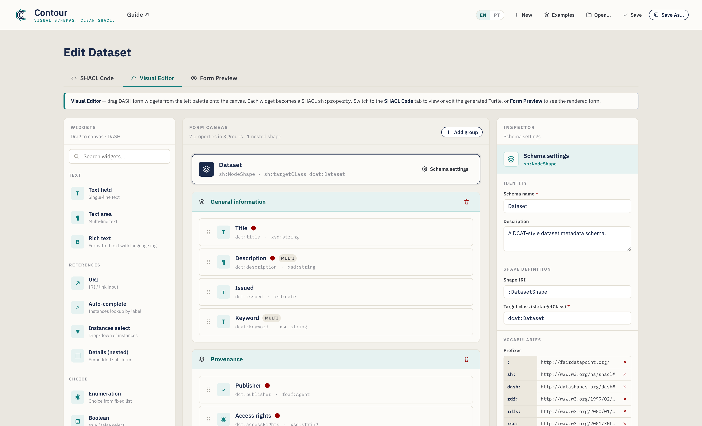

La ventana tiene tres pestañas:

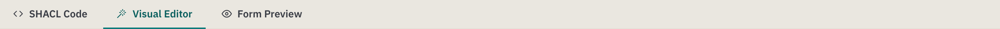

- **Código SHACL** — el esquema serializado. Turtle por defecto, con
  autocompletado; las ediciones se sincronizan de vuelta con el lienzo visual.
  Un selector de **sintaxis** ofrece además N-Triples, TriG, Notation3 y una
  exportación a **JSON-LD**. Es también donde se muestran los archivos que
  abres.
- **Editor visual** — el banco de trabajo de arrastrar y soltar (mostrado
  arriba). Es donde transcurre la mayor parte del trabajo.
- **Vista previa del formulario** — una representación realista del formulario
  de entrada de datos que produce tu esquema, para que pruebes la experiencia
  antes de publicar.

El **Editor visual** se divide en tres columnas:

| Columna | Función |
|---|---|
| **Widgets** (izquierda) | La paleta de controles de formulario. **Arrastra** uno hasta el lienzo, o simplemente **haz clic** en él (con teclado: foco + Enter) para añadirlo. |
| **Lienzo del formulario** (centro) | Tu esquema: el banner del objetivo, los grupos, las propiedades y las formas anidadas. |
| **Inspector** (derecha) | Los ajustes de lo que esté seleccionado en cada momento — el esquema, un grupo o una propiedad. |

Bajo el banco de trabajo hay una **barra de acciones** con un contador de
propiedades/grupos, un indicador de **Problemas** (una comprobación en vivo de
tu esquema — véase la [§5](#5-comprobar-tu-trabajo-el-panel-de-problemas)) y
botones de Guardar / Copiar. Para ver el esquema serializado, cambia a la
pestaña **Código SHACL**; para ver el formulario representado, cambia a **Vista
previa del formulario**.

La cabecera concentra las acciones de archivo — **Deshacer / Rehacer**,
**Nuevo**, **Recientes**, **Ejemplos**, **Abrir**, **Guardar**, **Guardar
como** — además del conmutador de idioma y un enlace a la **Guía**:

> **Tu trabajo se guarda sobre la marcha.** Contour mantiene un borrador
> autoguardado en tu navegador, de modo que recargar la página o cerrar la
> pestaña por accidente no lo pierde — al volver verás un aviso de *"Se ha
> restaurado tu borrador no guardado"*. **Deshacer/Rehacer** (o Ctrl/Cmd+Z y
> Ctrl/Cmd+Mayús+Z) recorren tus ediciones, y el menú **Recientes** vuelve a
> abrir esquemas que hayas guardado.

### Idioma de la interfaz

La interfaz de Contour está disponible en **inglés** (por defecto), **portugués
de Brasil**, **neerlandés**, **alemán**, **español** y **francés**. Cámbiala con
el selector de idioma (**EN / PT / NL / DE / ES / FR**) de la cabecera — tu
elección se recuerda entre sesiones. Si el idioma preferido de tu navegador es
uno de estos, Contour se abre en él automáticamente; de lo contrario, recurre al
inglés. Solo se traduce la interfaz; el contenido de tu esquema (nombres,
descripciones, rutas de propiedad) y el SHACL generado no se alteran nunca, por
lo que el Turtle exportado es idéntico en cualquier idioma.

---

## 3. Tutorial: crear un esquema *Dataset* desde cero

Vamos a crear un esquema de metadatos de **Dataset** al estilo
[DCAT](https://www.w3.org/TR/vocab-dcat-3/). Cada paso introduce una función de
la herramienta y, al terminar, habrás tocado todas las capacidades principales.

Contour **empieza en blanco** para que crees tu propio esquema desde cero — el
título de la página muestra *Nuevo esquema de metadatos* hasta que le pongas
nombre. Si prefieres explorar un esquema ya terminado, el menú **Ejemplos** de la
cabecera carga plantillas listas para usar (Dataset, Agente, Concepto); el
ejemplo *Dataset* coincide con el que construimos a continuación:

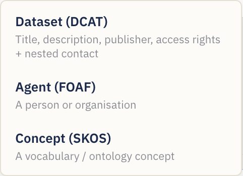

> A lo largo del tutorial, cambia a la pestaña **Editor visual** para trabajar.
> Para empezar un esquema nuevo en cualquier momento, usa el botón **Nuevo**.

### Paso 1 — Definir la identidad del esquema

Haz clic en el **banner del esquema** situado en la parte superior del lienzo
(muestra *Esquema sin título* hasta que le pongas nombre), o en el botón
**Ajustes del esquema**. El Inspector pasa a mostrar los ajustes a nivel de
esquema:

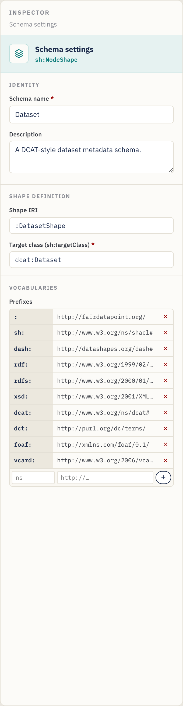

Rellena:

- **Nombre del esquema** — una etiqueta legible, p. ej., `Dataset`. (Una vez
  definido, el título de la página cambia de *Nuevo esquema de metadatos* a
  *Editar Dataset*; nómbralo para cualquier dominio —una clase de ontología, un
  catálogo— y el título lo acompaña.)
- **Descripción** — una frase que describa la finalidad del esquema.
- **IRI de la forma** — el identificador de la forma, p. ej., `:DatasetShape`. El
  `:` inicial usa tu espacio de nombres por defecto; puedes mantener el valor
  sugerido.
- **Clase objetivo** (`sh:targetClass`) — la clase RDF que este esquema valida,
  p. ej., `dcat:Dataset`. **Es obligatoria** para que el esquema resulte útil —
  es lo que le dice a una plataforma "aplica estas reglas a los registros de
  Dataset".

### Paso 2 — Gestionar vocabularios (prefijos)

Sin salir de los ajustes del esquema, desplázate hasta **Vocabularios**. Los
prefijos te permiten escribir términos cortos como `dct:title` en lugar de URL
completas.

El editor ya viene con los más comunes declarados — `sh`, `dash`, `rdf`, `rdfs`,
`xsd`, `dcat`, `dct`, `foaf` y el prefijo vacío por defecto `:`. Para añadir el
tuyo (por ejemplo, un vocabulario de dominio):

1. En la fila vacía al final de la tabla de prefijos, escribe el **alias** (p.
   ej., `vcard`) en la primera caja.
2. Escribe la **URL del espacio de nombres** (p. ej.,
   `http://www.w3.org/2006/vcard/ns#`) en la segunda caja.
3. Pulsa **Enter** o haz clic en el botón **+**.

Elimina un prefijo con la **×** que tiene al lado. Todo prefijo que uses en una
ruta de propiedad o en una clase debe declararse aquí para que el Turtle
exportado sea válido.

### Paso 3 — Organizar el formulario en grupos

Los grupos (`sh:PropertyGroup`) son las secciones de tu formulario. En un lienzo
en blanco, basta con que **arrastres tu primer widget al lienzo** y Contour crea
el primer grupo por ti — o haz clic en **Añadir grupo** (esquina superior derecha
del lienzo) para crear una sección vacía donde soltar widgets:

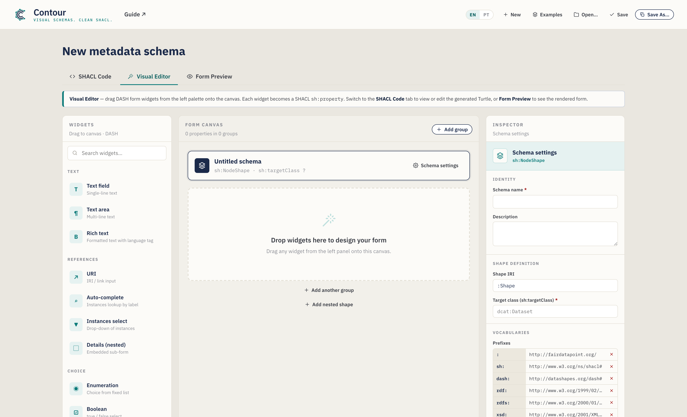

- **Renombra** un grupo haciendo clic en su título y escribiendo — p. ej.,
  `Información general`.
- **Reordena** con los botones **↑ / ↓** de la cabecera del grupo (esto
  renumera los grupos por ti).
- **Elimina** con el icono de papelera de la cabecera del grupo.

Para este tutorial, crea dos grupos: **General information** y **Provenance**.

### Paso 4 — Añadir tu primera propiedad (un campo de texto)

Desde la paleta de **Widgets** de la izquierda, añade un **Campo de texto** al
grupo *General information* — **arrástralo** hasta el grupo o, simplemente, **haz
clic** en él (se añade al grupo seleccionado, o al último). Quien use teclado
puede dar foco a un widget y pulsar **Enter**. Los widgets están organizados por
categoría (Texto, Referencias, Elección, Fecha y número) y se pueden buscar con
la caja de la parte superior.

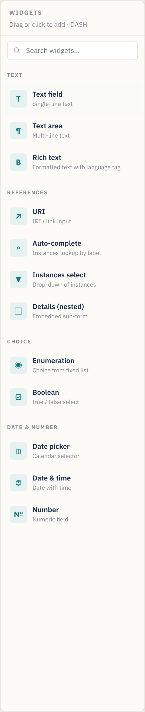

Al añadir un widget, este se convierte en una tarjeta de propiedad en el lienzo y
queda seleccionado automáticamente. Una tarjeta de propiedad muestra su etiqueta,
su ruta, su tipo y unas insignias de estado (un punto rojo para obligatorio, una
insignia "múltiple" para repetible):

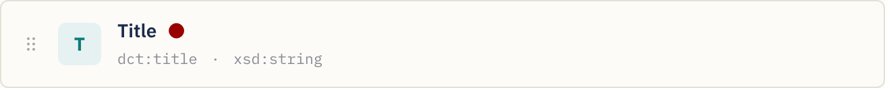

Cada tarjeta tiene tiradores para **reordenar arrastrando** (el asa de la
izquierda), **duplicar** y **eliminar** (los iconos de la derecha, al pasar el
ratón).

Con el nuevo campo seleccionado, el Inspector muestra sus **Ajustes de
propiedad**. Establece:

- **Etiqueta (`sh:name`)** → `Title` — la etiqueta del campo que se muestra a los
  usuarios.
- **Descripción** → texto de ayuda opcional (aparece como una sugerencia ⓘ en el
  formulario).
- **Ruta de propiedad (`sh:path`)** → `dct:title` — **el término RDF en el que
  escribe este campo**. Defínelo siempre; la ruta de marcador de posición por
  defecto no tiene sentido. A medida que escribes, Contour sugiere predicados
  comunes (y los prefijos que hayas declarado); elige uno o sigue escribiendo el
  tuyo.

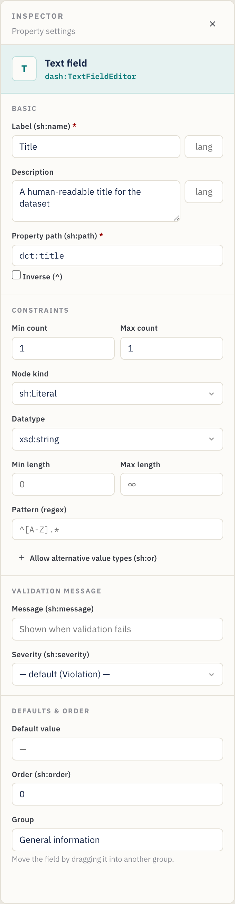

### Paso 5 — Establecer la cardinalidad y las restricciones de validación

La sección **Restricciones** del Inspector controla la validación. Para *Title*:

- **Recuento mín.** = `1`, **Recuento máx.** = `1` → se exige exactamente un
  título. (Un recuento mín. ≥ 1 hace que el campo sea obligatorio — fíjate en el
  punto rojo de la tarjeta y en el asterisco rojo de la vista previa del
  formulario.)
- **Tipo de nodo** = `sh:Literal` (un valor simple en lugar de un enlace).
- **Tipo de dato** = `xsd:string`.
- Opcionalmente, **Longitud mín./máx.** y un **Patrón** (una expresión regular,
  p. ej., `^[A-Z].*` para exigir una mayúscula inicial).

> **Chuleta de cardinalidad:** *Mín 1 / Máx 1* = obligatorio, valor único.
> *Mín 0 / Máx 1* = opcional, valor único. *Mín 1 / Máx ∞* (deja Máx vacío) =
> obligatorio, repetible. *Mín 0 / Máx ∞* = opcional, repetible.

**Rango de valores** (números y fechas). Los campos de Número, Fecha y Fecha y
hora muestran una sección **Rango de valores** — establece **Mín (≥)** / **Máx
(≤)** (inclusivos) o los límites exclusivos **(>)** / **(<)**. Los números se
escriben tal cual (`sh:minInclusive 1900`), y las fechas como literales tipados
(`"2020-01-01"^^xsd:date`).

**Mensaje de validación personalizado** (opcional). La sección **Mensaje de
validación** permite definir el texto que muestra una plataforma cuando este
campo falla (`sh:message`) y su **Gravedad** — *Violation* (por defecto),
*Warning* o *Info* (`sh:severity`).

### Paso 6 — Añadir una descripción de varias líneas

Arrastra un **Área de texto** a *General information*. Establece:

- **Etiqueta** → `Description`, **Ruta** → `dct:description`.
- **Recuento mín.** = `1`, deja **Recuento máx.** vacío (∞) para que se puedan
  aportar varias variantes de idioma. La tarjeta muestra ahora una insignia
  **múltiple**, y la vista previa del formulario gana un botón **+ Añadir**.

### Paso 7 — Añadir una propiedad de fecha

Arrastra un **Selector de fecha** a *General information*. Establece:

- **Etiqueta** → `Issued`, **Ruta** → `dct:issued`.
- **Recuento mín.** = `0`, **Recuento máx.** = `1` (opcional, único).
- El tipo de dato adopta por defecto `xsd:date`, lo correcto para una fecha de
  calendario. (Usa **Fecha y hora** en su lugar si necesitas una marca de tiempo
  — `xsd:dateTime`.)

### Paso 8 — Añadir un vocabulario controlado (enumeración)

Cambia al grupo *Provenance* y arrastra un widget de **Enumeración**. Crea una
lista desplegable restringida a un conjunto fijo de valores (`sh:in`).

En el Inspector aparece un editor de **Valores permitidos**:

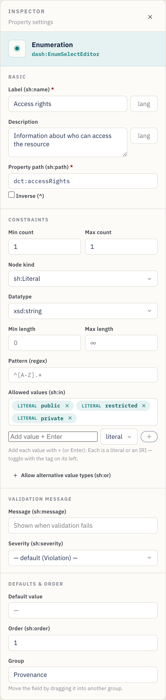

- **Etiqueta** → `Access rights`, **Ruta** → `dct:accessRights`.
- En **Valores permitidos**, escribe cada opción y pulsa **Enter**: `public`,
  `restricted`, `private`. Elimina una con su **×**.
- Recuento mín./máx. `1`/`1` para exigir exactamente una elección.

Los valores se exportan como `sh:in ( "public" "restricted" "private" )`.

> **Valores literales vs. IRI.** Cada valor permitido lleva un conmutador
> **literal / IRI** (la pequeña etiqueta a su izquierda). Mantenlo en **literal**
> para texto simple como `public`; cámbialo a **IRI** cuando las opciones sean
> términos de un vocabulario controlado (p. ej., `ex:Public`, un `skos:Concept`)
> para que se exporten como IRI y no como cadenas.

### Paso 9 — Referenciar otra entidad (IRI + clase)

Algunas propiedades apuntan a *otro recurso* en lugar de contener un valor
simple — por ejemplo, el **editor** del conjunto de datos es una organización, no
una cadena. Arrastra un widget de **Autocompletar** a *Provenance*. Representa
una caja de búsqueda que localiza instancias existentes.

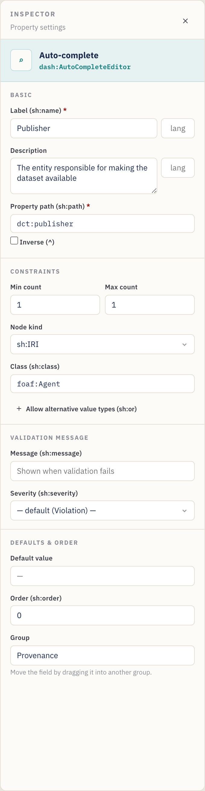

- **Etiqueta** → `Publisher`, **Ruta** → `dct:publisher`.
- **Tipo de nodo** = `sh:IRI` (el valor es un enlace/identificador).
- **Clase (`sh:class`)** → `foaf:Agent` — restringe el selector a instancias de
  esa clase. (La caja **Clase** solo aparece cuando el tipo de nodo está basado
  en IRI.)
- Recuento mín./máx. `1`/`1`.

> Otros widgets de referencia: **URI** (enlace libre), **Selección de
> instancias** (lista desplegable de instancias). Usa el que mejor se ajuste a
> cómo se elige el valor. La caja **Clase** sugiere clases comunes a medida que
> escribes.

> **Avanzado:** una propiedad también puede aceptar *o bien* un literal *o bien*
> un IRI (y reglas similares de "uno de estos tipos") mediante **Tipos de valor
> alternativos (`sh:or`)**, o seguir una relación hacia atrás con una ruta
> **Inversa (`^`)** — véase la
> [§6 Funciones avanzadas](#6-funciones-avanzadas-modelado-avanzado).

### Paso 10 — Modelar un subobjeto con una forma anidada

A veces un campo es, en sí mismo, un pequeño objeto estructurado. Un **punto de
contacto**, por ejemplo, tiene su propio *nombre* y *correo electrónico*. Modela
esto con una **forma anidada** y el widget **Detalles (anidado)**.

1. En la parte inferior del lienzo, haz clic en **Añadir forma anidada**. Aparece
   una nueva forma bajo el divisor *Formas anidadas* y queda seleccionada. En el
   Inspector, establece su **IRI de la forma** (p. ej., `:ContactShape`) y,
   opcionalmente, una **Clase objetivo** (p. ej., `vcard:Kind`). *Renombrar la
   IRI actualiza automáticamente todas las propiedades que la referencian.*
2. **Arrastra widgets a la forma anidada** igual que a un grupo — p. ej., un
   **Campo de texto** `Full name` (`vcard:fn`) y una **URI** `Email`
   (`vcard:hasEmail`).
3. De vuelta en un grupo, añade un widget **Detalles (anidado)**. En su
   Inspector, establece **Forma anidada (`sh:node`)** como `:ContactShape` (la
   caja ofrece tus formas anidadas como sugerencias).

> **Atajo.** En una propiedad **Detalles** puedes hacer clic en **Crear y
> vincular forma anidada** para acuñar una nueva forma y conectarle `sh:node` en
> un solo paso — luego solo tienes que añadir sus campos. La tarjeta de la
> propiedad muestra el enlace al que apunta (p. ej., `→ :ContactShape`), y el
> [panel de Problemas](#5-comprobar-tu-trabajo-el-panel-de-problemas) señala una
> propiedad Detalles cuyo objetivo falta.

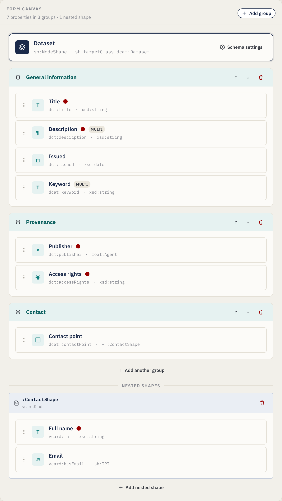

El Inspector de la propiedad Detalles la vincula a la forma anidada mediante
`sh:node`:

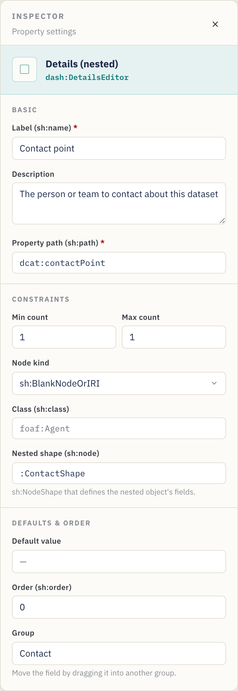

La tarjeta de la forma anidada en el lienzo contiene sus propias propiedades:

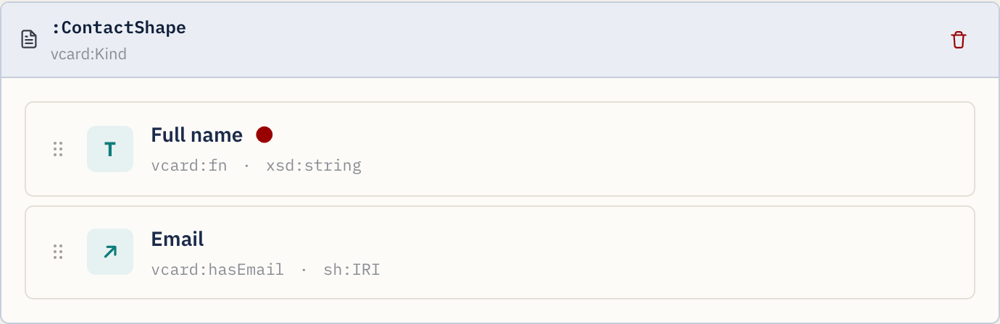

### Paso 11 — Previsualizar el formulario de entrada de datos

En cualquier momento, abre la pestaña **Vista previa del formulario** para
comprobar qué verá quien introduzca los metadatos. La vista previa refleja tus
restricciones: los campos obligatorios muestran un asterisco rojo, una pequeña
ficha de **cardinalidad** indica el recuento permitido (p. ej., `1–3`), las
descripciones se convierten en sugerencias ⓘ, los campos repetibles obtienen
botones **+ Añadir**, los patrones / longitudes / rangos se aplican a las
entradas, el texto con etiqueta de idioma obtiene una pequeña caja de idioma,
cualquier **mensaje de validación** aparece bajo el campo, y las propiedades
**Detalles** representan los campos de su forma anidada en línea — anidando a
cualquier profundidad:

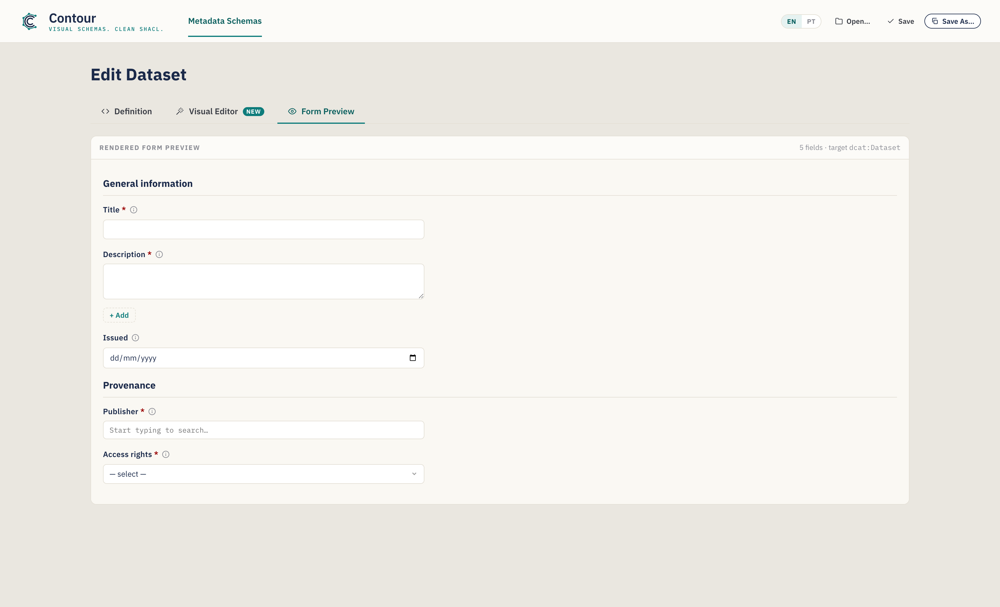

Esta vista previa es de solo lectura — está para validar el diseño, no para
capturar datos reales.

### Paso 12 — Revisar el SHACL generado

La pestaña **Código SHACL** muestra el Turtle generado a partir de tu diseño (y
permite editarlo directamente):

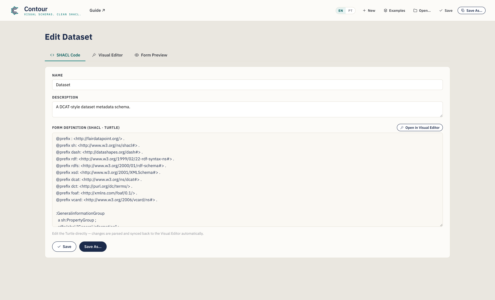

Todo lo que configuraste de forma visual está aquí — las declaraciones
`@prefix`, los `PropertyGroup`, la `NodeShape` con sus bloques `sh:property` y
cualquier forma anidada. El botón **Copiar SHACL** de la barra de acciones del
Editor visual coloca la serialización en tu portapapeles. Usa el selector de
**sintaxis** para ver o exportar otros formatos, incluido JSON-LD (véase la
[§4](#4-trabajar-directamente-con-el-código-la-pestaña-código-shacl)).

### Paso 13 — Guardar y exportar

Guarda tu esquema (un archivo `.ttl` por defecto):

- **Guardar como…** — elige un nuevo nombre y ubicación de archivo. La extensión
  sigue la sintaxis seleccionada (`.ttl`, `.nt`, `.trig`, `.n3` o `.jsonld`).
- **Guardar** — escribe en el archivo que abriste o guardaste por última vez
  (Ctrl/Cmd+S). El botón muestra brevemente **¡Guardado!** para confirmarlo.
- **Copiar SHACL** — copia la serialización actual sin guardar ningún archivo.
- **Recientes** (cabecera) — vuelve a abrir un esquema que guardaras antes en
  esta sesión.

> En Chrome/Edge el archivo se escribe directamente en el disco. En
> Firefox/Safari el editor recurre a una descarga normal. El nombre de archivo
> sugerido se deriva del nombre del esquema (p. ej., `dataset.ttl`). En cualquier
> caso, se mantiene un borrador autoguardado en tu navegador entre sesiones.

Sube el `.ttl` resultante a tu FAIR Data Point (u otra plataforma SHACL) como un
esquema de metadatos, y los registros de la clase objetivo se validarán —y los
formularios se representarán— conforme a tu diseño.

---

## 4. Trabajar directamente con el código (la pestaña Código SHACL)

¿Prefieres escribir o pegar SHACL a mano, o necesitas partir de una forma
existente? Usa la pestaña **Código SHACL**.

- **Sincronización bidireccional.** Las ediciones en el Turtle se analizan y se
  envían de vuelta al Editor visual automáticamente (en cuanto dejas de
  escribir). A la inversa, todo lo que construyas visualmente aparece aquí.
- **Autocompletado sensible al contexto** (Turtle). A medida que escribes, el
  editor sugiere predicados SHACL, tipos de nodo, tipos de dato XSD, editores
  DASH, grupos de propiedad declarados y líneas `@prefix`. Usa **↑/↓** para
  desplazarte, **Tab**/**Enter** para aceptar y **Esc** para descartar.

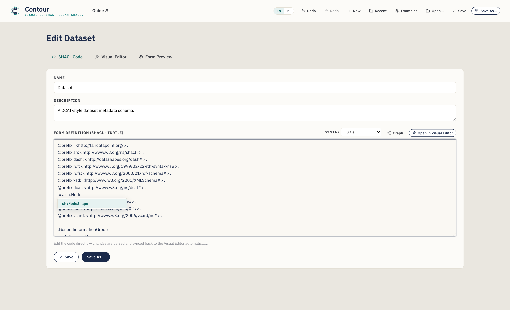

- **Abrir un archivo existente.** **Abrir…** en la cabecera carga un archivo
  `.ttl`/`.nt`/`.trig`/`.n3` en esta pestaña, detecta su sintaxis y lo analiza en
  el Editor visual — una forma rápida de adaptar un esquema existente. Si un
  archivo no se puede analizar, un mensaje en línea apunta a la línea
  problemática; aun así, puedes editar el texto en bruto.
- **Nombre y Descripción** del esquema también tienen campos sencillos en la
  parte superior de esta pestaña.

Haz clic en **Abrir en el Editor visual** para volver a la vista de arrastrar y
soltar.

### Elegir una sintaxis (y exportar JSON-LD)

Un selector de **sintaxis** en esta pestaña cambia la serialización entre
**Turtle** (por defecto), **N-Triples**, **TriG**, **Notation3** y **JSON-LD
(exportación)**. Las cuatro primeras son totalmente editables — las ediciones se
sincronizan de vuelta. El **JSON-LD es solo de exportación** (no hay analizador
de JSON-LD): el editor lo muestra en solo lectura para que puedas **Copiarlo** o
hacer **Guardar como** un archivo `.jsonld`, y luego volver a Turtle para seguir
editando.

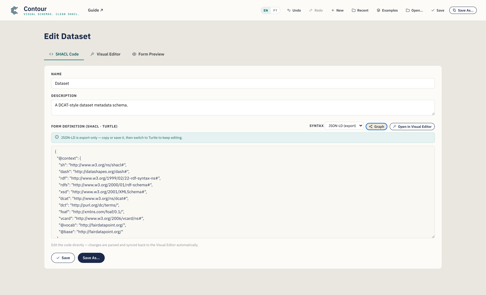

Los esquemas nuevos siempre empiezan en Turtle, y **Guardar como** usa la
extensión que corresponde a la sintaxis seleccionada.

### Editar un esquema existente es sin pérdidas

Contour analiza los archivos con un motor RDF de verdad, así que abrir, editar y
guardar un esquema **nunca descarta de forma silenciosa las partes que no modela
visualmente**. Las construcciones para las que el editor no tiene un control —
digamos `sh:and`, formas de valor cualificadas o anotaciones adicionales— se
**conservan literalmente** y se vuelven a emitir en un bloque *"Preserved"*
claramente comentado al final de la salida. Cuando un archivo cargado contiene
estas construcciones verás un breve aviso en esta pestaña; tus ediciones a las
partes que Contour *sí* modela se aplican con normalidad, y el resto hace el viaje
de ida y vuelta intacto.

### Visualizar el grafo

Haz clic en **Grafo** en esta pestaña para abrir una visualización de nodos y
enlaces del RDF del esquema en una superposición — formas, nodos de propiedad,
clases y literales, unidos por sus predicados. Desplázate para hacer zoom,
arrastra el fondo para desplazarte y arrastra un nodo para reubicarlo. Dos
conmutadores reducen el detalle (ambos activados por defecto): **Plegar listas**
contrae una lista `sh:in`/`sh:or` en una sola ficha, y **Ocultar anotaciones**
elimina las etiquetas y sugerencias de formulario (`sh:name`, `dash:editor`,
`sh:order`…) para que la estructura resalte. Es una forma rápida de ver el grafo
de formas (y cualquier forma anidada o construcción conservada) de un vistazo.

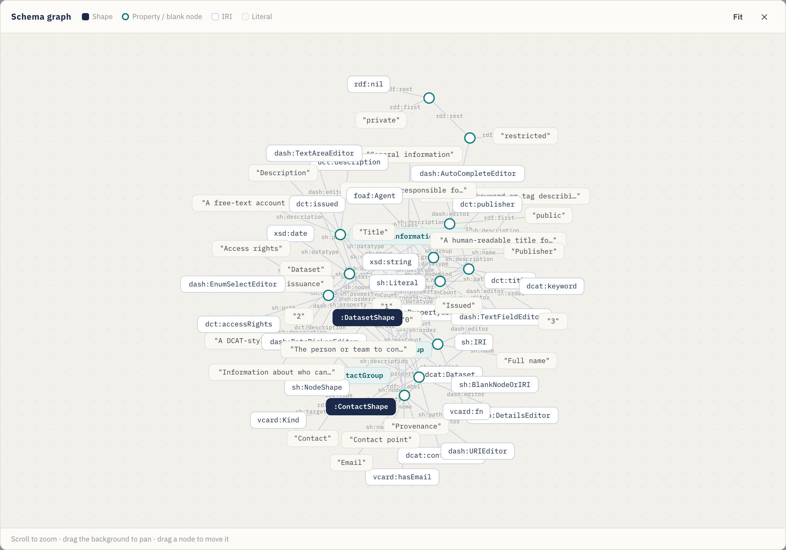

---

## 5. Comprobar tu trabajo (el panel de Problemas)

A medida que construyes, Contour comprueba el esquema de forma continua y resume
los problemas en el indicador de **Problemas** de la barra de acciones del Editor
visual. Haz clic en él para desplegar la lista; haz clic en cualquier elemento
para ir directamente al elemento problemático.

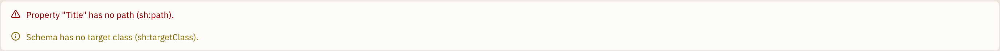

Señala cosas como:

- una propiedad **sin ruta**, o **rutas duplicadas** en el mismo grupo;
- una propiedad **Detalles** cuya forma anidada **falta**;
- una ruta, clase, tipo de dato o clase objetivo que usa un **prefijo que no has
  declarado**;
- una **clase objetivo** o un **nombre** de esquema que falta;
- formas anidadas con una IRI ausente o duplicada.

Los problemas son **no bloqueantes** — son orientación, no barreras — pero
resolverlos significa que el SHACL exportado está bien formado y solo referencia
vocabularios declarados.

---

## 6. Funciones avanzadas (modelado avanzado)

Más allá de los widgets y restricciones básicos, el Inspector expone algunos
controles avanzados para esquemas más ricos. Cada uno es opcional — recurre a
ellos cuando tu modelo los necesite.

### Etiquetas en varios idiomas

`sh:name` y `sh:description` pueden llevar una **etiqueta de idioma**, y puedes
añadir **traducciones** para que un campo quede etiquetado en varios idiomas. En
la sección **Básico**, escribe una etiqueta (p. ej., `en`) en la caja pequeña
que hay junto a la etiqueta; un editor de **traducciones** te permite entonces
añadir más (`pt` → "Título"…). Cada una se convierte en su propia sentencia con
etiqueta de idioma (`sh:name "Title"@en, "Título"@pt`), y la vista previa del
formulario muestra una caja de idioma en el campo.

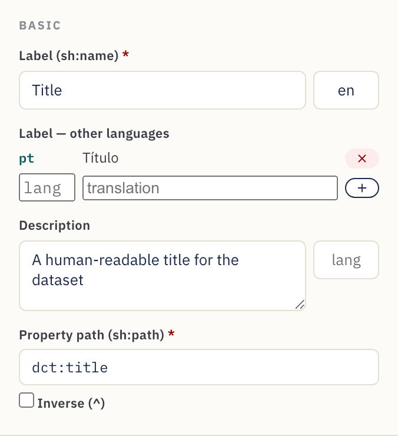

### Rangos numéricos y de fecha

Los campos de Número, Fecha y Fecha y hora muestran un bloque **Rango de
valores** en **Restricciones**. Establece **Mín (≥)** / **Máx (≤)** inclusivos o
los límites exclusivos **(>)** / **(<)** — p. ej., un año de publicación ≥ 1900.
Los números se exportan tal cual (`sh:minInclusive 1900`); las fechas, como
literales tipados (`"2000-01-01"^^xsd:date`).

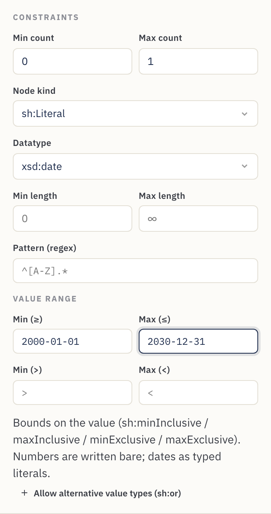

### Mensajes de validación personalizados

La sección **Mensaje de validación** establece el texto que muestra una
plataforma cuando un valor incumple la regla (`sh:message`) y su **Gravedad** —
*Violation* (por defecto), *Warning* o *Info* (`sh:severity`). Úsala para
convertir un fallo escueto en orientación amable para el data steward.

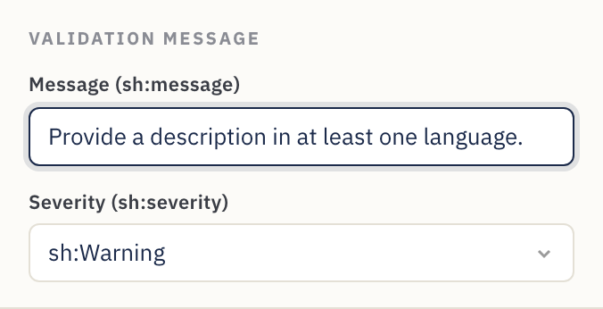

### Tipos de valor alternativos (literal *o* IRI)

Algunas propiedades aceptan legítimamente más de un tipo de valor — un tema que
puede ser texto libre *o* un IRI de vocabulario controlado, por ejemplo. Haz clic
en **Permitir tipos de valor alternativos (`sh:or`)** y enumera las ramas (cada
una un tipo de nodo, un tipo de dato o una clase). Se exporta como `sh:or ( [ … ]
[ … ] )`. Las formas lógicas más ricas que Contour no modela se conservan igual
en el viaje de ida y vuelta (véase la
[§4](#4-trabajar-directamente-con-el-código-la-pestaña-código-shacl)).

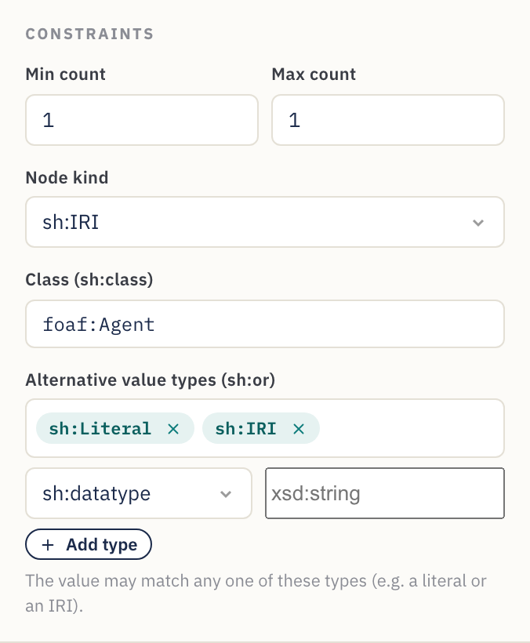

### Rutas inversas

Marca **Inversa (`^`)** junto a la ruta de propiedad para emparejar una relación
*hacia atrás* — "los recursos que apuntan a este" en lugar de al revés. Se
exporta como `sh:path [ sh:inversePath … ]`, y la tarjeta de la propiedad muestra
la ruta con un `^` por delante.

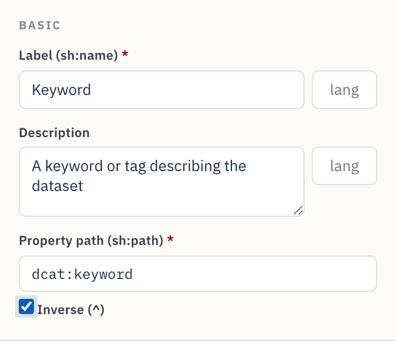

---

## 7. Referencia

### Catálogo de widgets

Cada widget se asigna a un editor DASH y a un tipo de nodo / tipo de dato por
defecto sensatos.

| Widget | Editor DASH | Uso típico | Valores predeterminados |
|---|---|---|---|
| **Campo de texto** | `dash:TextFieldEditor` | Texto de una línea | `sh:Literal`, `xsd:string` |
| **Área de texto** | `dash:TextAreaEditor` | Texto de varias líneas | `sh:Literal`, `xsd:string` |
| **Texto enriquecido** | `dash:RichTextEditor` | Texto con formato y etiqueta de idioma | `sh:Literal`, `rdf:HTML` |
| **URI** | `dash:URIEditor` | Enlace / IRI libre | `sh:IRI` |
| **Autocompletar** | `dash:AutoCompleteEditor` | Buscar una instancia por su etiqueta | `sh:IRI`, `sh:class foaf:Agent` |
| **Selección de instancias** | `dash:InstancesSelectEditor` | Lista desplegable de instancias | `sh:IRI` |
| **Detalles (anidado)** | `dash:DetailsEditor` | Subformulario incrustado mediante una forma anidada | `sh:BlankNodeOrIRI` |
| **Enumeración** | `dash:EnumSelectEditor` | Elección de una lista fija `sh:in` | `sh:Literal`, `xsd:string` |
| **Booleano** | `dash:BooleanSelectEditor` | verdadero / falso | `sh:Literal`, `xsd:boolean` |
| **Selector de fecha** | `dash:DatePickerEditor` | Fecha de calendario | `sh:Literal`, `xsd:date` |
| **Fecha y hora** | `dash:DateTimePickerEditor` | Marca de tiempo | `sh:Literal`, `xsd:dateTime` |
| **Número** | `dash:NumberFieldEditor` | Valor numérico | `sh:Literal`, `xsd:integer` |

Los valores predeterminados son puntos de partida — sobrescribe el tipo de nodo,
el tipo de dato o la clase en el Inspector siempre que tu modelo necesite algo
distinto.

### Referencia de los ajustes de propiedad

Lo que cada control del Inspector escribe en el SHACL:

| Campo del Inspector | Salida SHACL | Notas |
|---|---|---|
| Etiqueta | `sh:name` | La etiqueta del formulario. Una **etiqueta de idioma** opcional + **traducciones** adicionales emiten un `sh:name` por idioma. |
| Descripción | `sh:description` | Texto de ayuda / sugerencia ⓘ. También admite etiqueta de idioma, con traducciones. |
| Ruta de propiedad | `sh:path` | **Obligatorio.** El predicado RDF. **Inversa (`^`)** emite `[ sh:inversePath … ]`. |
| Recuento mín. | `sh:minCount` | ≥ 1 hace que el campo sea obligatorio. |
| Recuento máx. | `sh:maxCount` | Vacío = ilimitado (repetible). |
| Tipo de nodo | `sh:nodeKind` | `sh:Literal`, `sh:IRI`, `sh:BlankNode` o combinaciones. |
| Tipo de dato | `sh:datatype` | Se muestra para los tipos de nodo literales. |
| Clase | `sh:class` | Se muestra para los tipos de nodo IRI; restringe el tipo objetivo. |
| Forma anidada | `sh:node` | Se muestra para **Detalles**; enlaza con una forma anidada. |
| Longitud mín. / máx. | `sh:minLength` / `sh:maxLength` | Solo literales. |
| Rango de valores | `sh:minInclusive` / `maxInclusive` / `minExclusive` / `maxExclusive` | Números y fechas. |
| Patrón (regex) | `sh:pattern` | Solo literales. |
| Valores permitidos | `sh:in ( … )` | Opciones de enumeración; cada valor literal o IRI. |
| Tipos de valor alternativos | `sh:or ( … )` | "Aceptar uno de estos tipos" (p. ej., literal **o** IRI). |
| Mensaje / Gravedad | `sh:message` / `sh:severity` | Texto de validación personalizado + Violation / Warning / Info. |
| Valor predeterminado | `sh:defaultValue` | Valor precargado. |
| Orden | `sh:order` | El orden del campo dentro de su grupo. |

Controles a nivel de esquema y de grupo:

| Control | Salida SHACL |
|---|---|
| Nombre del esquema | `rdfs:label` en la NodeShape |
| IRI de la forma | el sujeto de la NodeShape |
| Clase objetivo | `sh:targetClass` |
| Prefijos | declaraciones `@prefix` |
| Etiqueta del grupo | `rdfs:label` en el `sh:PropertyGroup` |
| Orden del grupo | `sh:order` en el grupo; el `sh:group` del campo lo enlaza |

---

## 8. Recetas — patrones de modelado habituales

Patrones cortos y autocontenidos que puedes aplicar sobre el tutorial.

**Hacer que un campo sea obligatorio.** Establece **Recuento mín.** en `1`. La
tarjeta muestra un punto rojo y el formulario lo marca con `*`.

**Permitir varios valores.** Deja **Recuento máx.** vacío (∞). La tarjeta muestra
una insignia **múltiple** y el formulario gana **+ Añadir**.

**Restringir a una lista fija.** Usa el widget **Enumeración** y rellena
**Valores permitidos**. Se exporta como `sh:in`.

**Enlazar con una organización o persona.** Usa **Autocompletar** (o **Selección
de instancias**), el tipo de nodo `sh:IRI` y **Clase** = `foaf:Agent` (o la clase
que elijas).

**Capturar un subobjeto estructurado** (dirección, punto de contacto,
distribución). Crea una **forma anidada**, añade sus campos y luego apunta una
propiedad **Detalles (anidado)** hacia ella mediante `sh:node`. Véase el
[Paso 10](#paso-10--modelar-un-subobjeto-con-una-forma-anidada).

**Imponer un formato.** Para literales, establece un **Patrón** (regex) o una
**Longitud mín./máx.** —p. ej., un patrón de ORCID, o una longitud máxima en un
campo de código.

**Acotar un número o una fecha.** En un campo de Número / Fecha, usa la sección
**Rango de valores** —p. ej., *Mín (≥)* `1900` para un año, o *Máx (≤)* una fecha
límite.

**Ofrecer una etiqueta en varios idiomas.** Establece una **etiqueta de idioma**
en la **Etiqueta** (p. ej., `en`) y añade **traducciones** (`pt` → "Título"…).
Cada una se convierte en un `sh:name` con etiqueta de idioma, y la vista previa
del formulario muestra una caja de idioma.

**Aceptar un literal *o* un IRI** (o "uno de estos tipos"). Usa **Tipos de valor
alternativos (`sh:or`)** en la propiedad y enumera las ramas (p. ej.,
`sh:nodeKind sh:Literal` y `sh:nodeKind sh:IRI`). Habitual en DCAT-AP para
valores que pueden ser texto en línea o una referencia.

**Seguir una relación hacia atrás.** Marca **Inversa (`^`)** en la ruta para
emparejar "cosas que apuntan a este recurso" (p. ej., los miembros de una
colección) — se exporta como `[ sh:inversePath … ]`.

**Explicar una regla de validación.** Rellena el **Mensaje de validación** con
texto amable para el data steward y elige una **Gravedad** para que una
plataforma pueda mostrar un Warning útil en lugar de un fallo escueto.

**Exportar a JSON-LD.** En la pestaña Código SHACL, pon la **sintaxis** en
*JSON-LD (exportación)* y haz **Copiar** o **Guardar como** `.jsonld` para
herramientas que consumen JSON-LD.

**Partir de un ejemplo.** Usa el menú **Ejemplos** para cargar una plantilla de
Dataset (DCAT), Agente (FOAF) o Concepto (SKOS), y luego adáptala a tus
necesidades.

**Reutilizar un esquema existente.** **Abre…** el archivo existente, adáptalo en
el Editor visual y luego haz **Guardar como…** un nuevo archivo — todo lo que
Contour no modela se conserva (véase la
[§4](#4-trabajar-directamente-con-el-código-la-pestaña-código-shacl)).

---

## 9. Consejos y resolución de problemas

- **Establece siempre la ruta de propiedad.** Los widgets nuevos reciben una ruta
  de marcador de posición como `:textfield`; sustitúyela por el término RDF real
  (`dct:title`, `dcat:theme`…) o los metadatos exportados no usarán el término
  que pretendes.
- **Declara los prefijos que uses.** Si una ruta o clase usa un alias (p. ej.,
  `vcard:`), añádelo en **Vocabularios** para que el Turtle sea válido.
- **Un campo ha ido al grupo equivocado.** Arrastra la tarjeta de la propiedad
  hasta el grupo correcto; la caja **Grupo** del Inspector es de solo lectura y
  refleja el cambio.
- **Las ediciones en Código SHACL no se han sincronizado.** La sincronización
  ocurre poco después de que dejas de escribir. Si se muestra un error de
  análisis (con número de línea), corrige el Turtle — el lienzo visual mantiene
  el último estado válido hasta que el texto se analiza.
- **El botón Guardar solo descarga.** Es el comportamiento esperado en
  Firefox/Safari. Para guardados in situ, usa un navegador basado en Chromium
  (Chrome/Edge).
- **¿Te has equivocado?** **Deshacer** (Ctrl/Cmd+Z) / **Rehacer**
  (Ctrl/Cmd+Mayús+Z) cubren cada edición, y tu trabajo se autoguarda — una
  recarga lo restaura.
- **Revisa el panel de Problemas.** Antes de exportar, despliega **Problemas** en
  la barra de acciones y resuelve cualquier error (rutas vacías, prefijos no
  declarados, `sh:node` roto).
- **¿Editando JSON-LD?** No se puede — es solo de exportación. Cambia la
  **sintaxis** de vuelta a Turtle (o N-Triples / TriG / N3) para seguir editando.
- **Empezar de cero.** Usa el botón **Nuevo** para un esquema en blanco, carga
  uno desde **Ejemplos** o **Abre…** un archivo existente.

---

*Creado con Contour para el ecosistema FAIR Data Point. La salida es SHACL + DASH
estándar y funciona con cualquier herramienta compatible con SHACL.*
