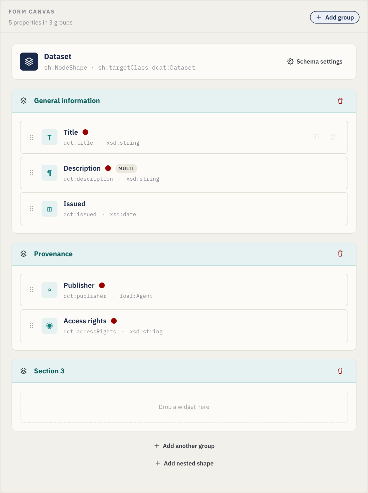
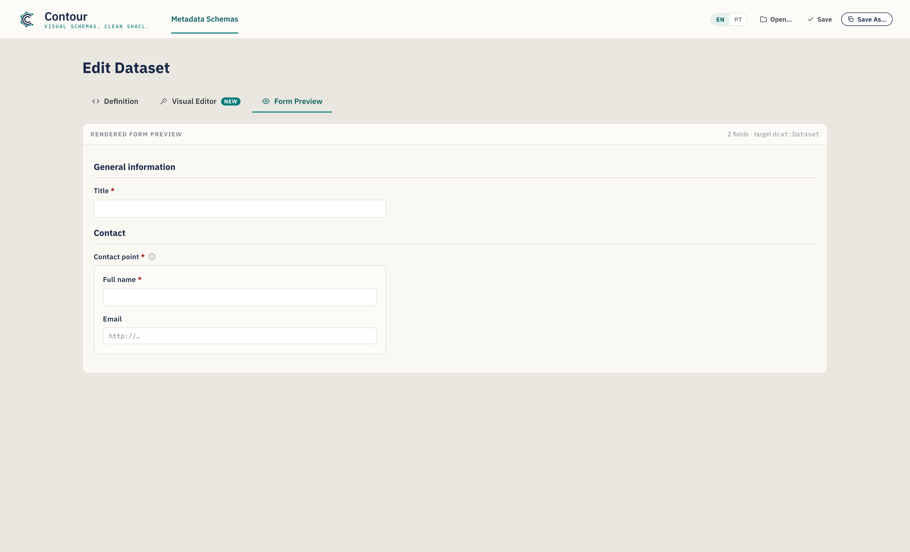
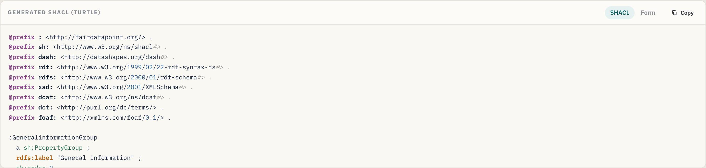
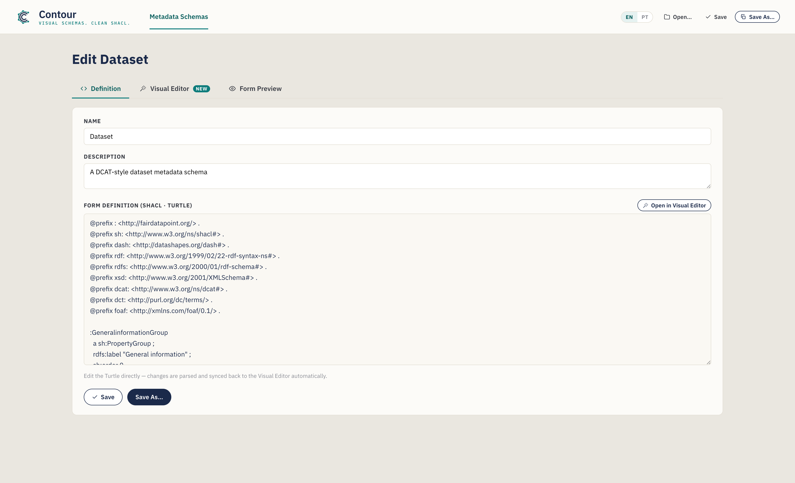

# Creating Metadata Schemas — A Guide for Data Stewards

**Contour** lets you design custom metadata schemas visually —
by dragging form widgets onto a canvas — and exports them as standards-compliant
[SHACL](https://www.w3.org/TR/shacl/) shapes with [DASH](https://datashapes.org/forms.html)
form annotations. The output drops straight into a
[FAIR Data Point](https://fairdatapoint.org/) or any SHACL-aware platform.

> *Contour's tagline: **Visual schemas. Clean SHACL.***

This guide is written for **data stewards** who want to define what metadata
their community must (or may) provide for a given type of resource — a dataset,
a study, a sample, a software package — without hand-writing Turtle.

> **No installation, no server.** The editor is a single self-contained web page.
> Open it in Chrome or Edge (recommended, for direct file save) — Firefox and
> Safari work too, with a download-style save.

---

## Table of contents

1. [What you are building (key concepts)](#1-what-you-are-building-key-concepts)
2. [The interface at a glance](#2-the-interface-at-a-glance)
3. [Tutorial: build a *Dataset* schema from scratch](#3-tutorial-build-a-dataset-schema-from-scratch)
   - [Step 1 — Define the schema identity](#step-1--define-the-schema-identity)
   - [Step 2 — Manage vocabularies (prefixes)](#step-2--manage-vocabularies-prefixes)
   - [Step 3 — Organise the form into groups](#step-3--organise-the-form-into-groups)
   - [Step 4 — Add your first property (a text field)](#step-4--add-your-first-property-a-text-field)
   - [Step 5 — Set cardinality and validation constraints](#step-5--set-cardinality-and-validation-constraints)
   - [Step 6 — Add a multi-line description](#step-6--add-a-multi-line-description)
   - [Step 7 — Add a date property](#step-7--add-a-date-property)
   - [Step 8 — Add a controlled vocabulary (enumeration)](#step-8--add-a-controlled-vocabulary-enumeration)
   - [Step 9 — Reference another entity (IRI + class)](#step-9--reference-another-entity-iri--class)
   - [Step 10 — Model a sub-object with a nested shape](#step-10--model-a-sub-object-with-a-nested-shape)
   - [Step 11 — Preview the data-entry form](#step-11--preview-the-data-entry-form)
   - [Step 12 — Review the generated SHACL](#step-12--review-the-generated-shacl)
   - [Step 13 — Save and export](#step-13--save-and-export)
4. [Working directly with Turtle (the Definition tab)](#4-working-directly-with-turtle-the-definition-tab)
5. [Reference](#5-reference)
   - [Widget catalogue](#widget-catalogue)
   - [Property settings reference](#property-settings-reference)
6. [Recipes — common modelling patterns](#6-recipes--common-modelling-patterns)
7. [Tips & troubleshooting](#7-tips--troubleshooting)

---

## 1. What you are building (key concepts)

A metadata schema in this tool is a **SHACL NodeShape**: a description of what a
valid record of a given kind looks like. A few terms you will meet throughout:

| Term | What it means for you |
|---|---|
| **NodeShape** | The schema itself — e.g. "what a Dataset record must contain". |
| **Target class** (`sh:targetClass`) | The RDF type the schema applies to, e.g. `dcat:Dataset`. Records of this type are validated against your schema. |
| **Property** (`sh:property`) | A single field — title, publisher, issue date, … Each property has a *path*, a *widget*, and *constraints*. |
| **Property path** (`sh:path`) | The RDF predicate the field writes to, e.g. `dct:title`. This is the actual term stored in the metadata. |
| **Widget** (`dash:editor`) | The form control shown to the person filling in metadata — a text box, a date picker, a drop-down, etc. |
| **Group** (`sh:PropertyGroup`) | A visual section that bundles related fields, e.g. "General information". |
| **Prefix** (`@prefix`) | A short alias for a vocabulary namespace, e.g. `dct:` → `http://purl.org/dc/terms/`. |

You design all of this visually; the tool writes the SHACL for you.

---

## 2. The interface at a glance

The window has three tabs:

- **Definition** — the raw SHACL Turtle, with autocomplete. Edits here sync back
  to the visual canvas. This is also where files you open are shown.
- **Visual Editor** — the drag-and-drop workbench (shown above). This is where
  most of your work happens.
- **Form Preview** — a realistic rendering of the data-entry form your schema
  produces, so you can test the experience before publishing.

The **Visual Editor** is split into three columns:

| Column | Purpose |
|---|---|
| **Widgets** (left) | The palette of form controls you drag onto the canvas. |
| **Form canvas** (centre) | Your schema: the target banner, groups, properties, and nested shapes. |
| **Inspector** (right) | Settings for whatever is currently selected — the schema, a group, or a property. |

Below the workbench is a live preview pane that toggles between the generated
**SHACL** and the rendered **Form**, and an actions bar with a property/group
counter and Save buttons.

File operations live in the top-right of the header:

### Interface language

Contour's interface is available in **English** (default) and **Brazilian
Portuguese**. Switch with the **EN / PT** toggle in the header — your choice is
remembered between sessions. Only the interface is translated; your schema
content (names, descriptions, property paths) and the generated SHACL are never
altered, so the exported Turtle is identical in either language.

---

## 3. Tutorial: build a *Dataset* schema from scratch

We will build a [DCAT](https://www.w3.org/TR/vocab-dcat-3/)-style **Dataset**
metadata schema. Each step introduces one feature of the tool, and by the end
you will have touched every major capability. The editor opens with a small
example *Dataset* schema already loaded — you can follow along by adjusting it,
or clear it and start fresh.

> Throughout, switch to the **Visual Editor** tab to do the work.

### Step 1 — Define the schema identity

Click the **schema banner** at the top of the canvas (the blue "Dataset" card),
or the **Schema settings** button. The Inspector switches to schema-level
settings:

Fill in:

- **Schema name** — a human label, e.g. `Dataset`. (This also appears in the
  page title: *Edit Dataset*.)
- **Description** — a sentence describing the schema's purpose.
- **Shape IRI** — the identifier of the shape, e.g. `:DatasetShape`. The leading
  `:` uses your default namespace; you can leave the suggested value.
- **Target class** (`sh:targetClass`) — the RDF class this schema validates, e.g.
  `dcat:Dataset`. **This is required** for the schema to be useful — it is what
  tells a platform "apply these rules to Dataset records".

### Step 2 — Manage vocabularies (prefixes)

Still in schema settings, scroll to **Vocabularies**. Prefixes let you write
short terms like `dct:title` instead of full URLs.

The editor ships with the common ones already declared — `sh`, `dash`, `rdf`,
`rdfs`, `xsd`, `dcat`, `dct`, `foaf`, and the default empty prefix `:`. To add
your own (for example a domain vocabulary):

1. In the empty row at the bottom of the prefix table, type the **alias** (e.g.
   `vcard`) in the first box.
2. Type the **namespace URL** (e.g. `http://www.w3.org/2006/vcard/ns#`) in the
   second box.
3. Press **Enter** or click the **+** button.

Remove a prefix with the **×** next to it. Any prefix you use in a property path
or class should be declared here so the exported Turtle is valid.

### Step 3 — Organise the form into groups

Groups (`sh:PropertyGroup`) are the sections of your form. Click **Add group**
(top-right of the canvas, or **Add another group** at the bottom). A new empty
section appears with a drop zone:

- **Rename** a group by clicking its title and typing — e.g. `General information`.
- **Reorder** by setting the group's **Order** in the Inspector (select the group
  header first).
- **Delete** with the trash icon on the group header.

For this tutorial, create two groups: **General information** and **Provenance**.

### Step 4 — Add your first property (a text field)

From the **Widgets** palette on the left, **drag** a **Text field** onto the
*General information* group. Widgets are organised by category (Text, References,
Choice, Date & number) and searchable via the box at the top.

When you drop a widget, it becomes a property card on the canvas and is selected
automatically. A property card shows its label, path, type, and status badges
(a red dot for required, a "multi" badge for repeatable):

Each card has handles to **drag-reorder** (the grip on the left), **duplicate**,
and **delete** (the icons on the right, on hover).

With the new field selected, the Inspector shows its **Property settings**. Set:

- **Label (`sh:name`)** → `Title` — the field label shown to users.
- **Description** → optional help text (appears as an ⓘ tooltip on the form).
- **Property path (`sh:path`)** → `dct:title` — **the RDF term this field writes**.
  Always set this; the default placeholder path is not meaningful.

### Step 5 — Set cardinality and validation constraints

The **Constraints** section of the Inspector controls validation. For *Title*:

- **Min count** = `1`, **Max count** = `1` → exactly one title is required.
  (Min count ≥ 1 makes the field required — note the red dot on the card and the
  red asterisk in the form preview.)
- **Node kind** = `sh:Literal` (a plain value rather than a link).
- **Datatype** = `xsd:string`.
- Optionally **Min/Max length** and a **Pattern** (a regular expression, e.g.
  `^[A-Z].*` to require an initial capital).

> **Cardinality cheat-sheet:** *Min 1 / Max 1* = required, single value.
> *Min 0 / Max 1* = optional, single value. *Min 1 / Max ∞* (leave Max empty) =
> required, repeatable. *Min 0 / Max ∞* = optional, repeatable.

### Step 6 — Add a multi-line description

Drag a **Text area** into *General information*. Set:

- **Label** → `Description`, **Path** → `dct:description`.
- **Min count** = `1`, leave **Max count** empty (∞) so multiple
  language variants can be provided. The card now shows a **multi** badge, and
  the form preview gains a **+ Add** button.

### Step 7 — Add a date property

Drag a **Date picker** into *General information*. Set:

- **Label** → `Issued`, **Path** → `dct:issued`.
- **Min count** = `0`, **Max count** = `1` (optional, single).
- The datatype defaults to `xsd:date`, which is correct for a calendar date.
  (Use **Date & time** instead if you need a timestamp — `xsd:dateTime`.)

### Step 8 — Add a controlled vocabulary (enumeration)

Switch to the *Provenance* group and drag an **Enumeration** widget in. This
creates a drop-down restricted to a fixed list of values (`sh:in`).

In the Inspector, an **Allowed values** editor appears:

- **Label** → `Access rights`, **Path** → `dct:accessRights`.
- In **Allowed values**, type each option and press **Enter**: `public`,
  `restricted`, `private`. Remove one with its **×**.
- Min/Max count `1`/`1` to require exactly one choice.

The values are exported as `sh:in ( "public" "restricted" "private" )`.

### Step 9 — Reference another entity (IRI + class)

Some properties point to *another resource* rather than holding a plain value —
for example the dataset's **publisher** is an organisation, not a string. Drag an
**Auto-complete** widget into *Provenance*. This renders a search box that looks
up existing instances.

- **Label** → `Publisher`, **Path** → `dct:publisher`.
- **Node kind** = `sh:IRI` (the value is a link/identifier).
- **Class (`sh:class`)** → `foaf:Agent` — restricts the picker to instances of
  that class. (The **Class** box only appears when the node kind is IRI-based.)
- Min/Max count `1`/`1`.

> Other reference widgets: **URI** (free-form link), **Instances select** (a
> drop-down of instances). Use whichever fits how the value is chosen.

### Step 10 — Model a sub-object with a nested shape

Sometimes a field is itself a small structured object. A **contact point**, for
instance, has its own *name* and *email*. Model this with a **nested shape** and
the **Details (nested)** widget.

1. At the bottom of the canvas, click **Add nested shape**. A new shape appears
   under the *Nested shapes* divider and is selected. In the Inspector set its
   **Shape IRI** (e.g. `:ContactShape`) and optionally a **Target class** (e.g.
   `vcard:Kind`). *Renaming the IRI automatically updates every property that
   references it.*
2. **Drag widgets onto the nested shape** just like a group — e.g. a **Text
   field** `Full name` (`vcard:fn`) and a **URI** `Email` (`vcard:hasEmail`).
3. Back in a group, drag in a **Details (nested)** widget. In its Inspector, set
   **Nested shape (`sh:node`)** to `:ContactShape` (the box offers your nested
   shapes as suggestions).

The Details property's Inspector links it to the nested shape via `sh:node`:

The nested shape card on the canvas holds its own properties:

### Step 11 — Preview the data-entry form

At any point, check what the person entering metadata will see. Use the
**Form** toggle in the preview pane, or open the full **Form Preview** tab.
Required fields show a red asterisk, descriptions become ⓘ tooltips, repeatable
fields get **+ Add** buttons, and **Details** properties render their nested
shape's fields inline:

This preview is read-only — it is there to validate the design, not to capture
real data.

### Step 12 — Review the generated SHACL

In the Visual Editor, the preview pane's **SHACL** toggle shows the Turtle being
generated live as you work:

Everything you configured visually is here — `@prefix` declarations, the
`PropertyGroup`s, the `NodeShape` with its `sh:property` blocks, and any nested
shapes. Use **Copy** to put it on your clipboard.

### Step 13 — Save and export

Save your schema as a `.ttl` file:

- **Save As…** — choose a new file name and location.
- **Save** — write back to the file you last opened/saved (Ctrl/Cmd+S). The
  button briefly shows **Saved!** to confirm.
- **Copy SHACL** — copy the Turtle without saving a file.

> In Chrome/Edge the file is written directly to disk. In Firefox/Safari the
> editor falls back to a normal download. The suggested file name is derived from
> the schema name (e.g. `dataset.ttl`).

Upload the resulting `.ttl` to your FAIR Data Point (or other SHACL platform) as
a metadata schema, and records of the target class will be validated — and forms
rendered — according to your design.

---

## 4. Working directly with Turtle (the Definition tab)

Prefer to write or paste SHACL by hand, or need to start from an existing shape?
Use the **Definition** tab.

- **Two-way sync.** Edits to the Turtle are parsed and pushed back to the Visual
  Editor automatically (after you pause typing). Conversely, anything you build
  visually appears here.
- **Context-aware autocomplete.** As you type, the editor suggests SHACL
  predicates, node kinds, XSD datatypes, DASH editors, declared property groups,
  and `@prefix` lines. Use **↑/↓** to move, **Tab**/**Enter** to accept,
  **Esc** to dismiss.

- **Open an existing file.** **Open…** in the header loads a `.ttl`/`.shacl`
  file into this tab and parses it into the Visual Editor — a fast way to adapt
  an existing schema. If a file can't be parsed, an inline message points to the
  problem line; you can still edit the raw text.
- **Name & Description** for the schema also have plain inputs at the top of this
  tab.

Click **Open in Visual Editor** to jump back to the drag-and-drop view.

---

## 5. Reference

### Widget catalogue

Every widget maps to a DASH editor and sensible default node kind / datatype.

| Widget | DASH editor | Typical use | Defaults |
|---|---|---|---|
| **Text field** | `dash:TextFieldEditor` | Single-line text | `sh:Literal`, `xsd:string` |
| **Text area** | `dash:TextAreaEditor` | Multi-line text | `sh:Literal`, `xsd:string` |
| **Rich text** | `dash:RichTextEditor` | Formatted text with language tag | `sh:Literal`, `rdf:HTML` |
| **URI** | `dash:URIEditor` | Free-form link / IRI | `sh:IRI` |
| **Auto-complete** | `dash:AutoCompleteEditor` | Look up an instance by label | `sh:IRI`, `sh:class foaf:Agent` |
| **Instances select** | `dash:InstancesSelectEditor` | Drop-down of instances | `sh:IRI` |
| **Details (nested)** | `dash:DetailsEditor` | Embedded sub-form via a nested shape | `sh:BlankNodeOrIRI` |
| **Enumeration** | `dash:EnumSelectEditor` | Choice from a fixed `sh:in` list | `sh:Literal`, `xsd:string` |
| **Boolean** | `dash:BooleanSelectEditor` | true / false | `sh:Literal`, `xsd:boolean` |
| **Date picker** | `dash:DatePickerEditor` | Calendar date | `sh:Literal`, `xsd:date` |
| **Date & time** | `dash:DateTimePickerEditor` | Timestamp | `sh:Literal`, `xsd:dateTime` |
| **Number** | `dash:NumberFieldEditor` | Numeric value | `sh:Literal`, `xsd:integer` |

Defaults are starting points — override the node kind, datatype, or class in the
Inspector whenever your model needs something different.

### Property settings reference

What each Inspector control writes into SHACL:

| Inspector field | SHACL output | Notes |
|---|---|---|
| Label | `sh:name` | The form label. |
| Description | `sh:description` | Help text / ⓘ tooltip. |
| Property path | `sh:path` | **Required.** The RDF predicate. |
| Min count | `sh:minCount` | ≥ 1 makes the field required. |
| Max count | `sh:maxCount` | Empty = unbounded (repeatable). |
| Node kind | `sh:nodeKind` | `sh:Literal`, `sh:IRI`, `sh:BlankNode`, or combinations. |
| Datatype | `sh:datatype` | Shown for literal node kinds. |
| Class | `sh:class` | Shown for IRI node kinds; restricts the target type. |
| Nested shape | `sh:node` | Shown for **Details**; links to a nested shape. |
| Min / Max length | `sh:minLength` / `sh:maxLength` | Literals only. |
| Pattern (regex) | `sh:pattern` | Literals only. |
| Allowed values | `sh:in ( … )` | Enumeration choices. |
| Default value | `sh:defaultValue` | Pre-filled value. |
| Order | `sh:order` | Field order within its group. |

Schema- and group-level controls:

| Control | SHACL output |
|---|---|
| Schema name | `rdfs:label` on the NodeShape |
| Shape IRI | the NodeShape subject |
| Target class | `sh:targetClass` |
| Prefixes | `@prefix` declarations |
| Group label | `rdfs:label` on the `sh:PropertyGroup` |
| Group order | `sh:order` on the group; field's `sh:group` links it |

---

## 6. Recipes — common modelling patterns

Short, self-contained patterns you can apply on top of the tutorial.

**Make a field required.** Set **Min count** to `1`. The card shows a red dot and
the form marks it with `*`.

**Allow multiple values.** Leave **Max count** empty (∞). The card shows a
**multi** badge and the form gains **+ Add**.

**Restrict to a fixed list.** Use the **Enumeration** widget and fill in
**Allowed values**. Exports as `sh:in`.

**Link to an organisation or person.** Use **Auto-complete** (or **Instances
select**), node kind `sh:IRI`, and **Class** = `foaf:Agent` (or your chosen
class).

**Capture a structured sub-object** (address, contact point, distribution).
Create a **nested shape**, add its fields, then point a **Details (nested)**
property at it via `sh:node`. See [Step 10](#step-10--model-a-sub-object-with-a-nested-shape).

**Enforce a format.** For literals, set a **Pattern** (regex) and/or **Min/Max
length** — e.g. an ORCID pattern, or a max length on a code field.

**Reuse an existing schema.** **Open…** the existing `.ttl`, adapt it in the
Visual Editor, then **Save As…** a new file.

---

## 7. Tips & troubleshooting

- **Always set the property path.** New widgets get a placeholder path like
  `:textfield`; replace it with the real RDF term (`dct:title`, `dcat:theme`, …)
  or the exported metadata won't use the term you intend.
- **Declare the prefixes you use.** If a path or class uses an alias (e.g.
  `vcard:`), add it under **Vocabularies** so the Turtle is valid.
- **A field went to the wrong group.** Drag the property card into the correct
  group; the **Group** box in the Inspector is read-only and reflects the move.
- **Definition-tab edits didn't sync.** Syncing happens shortly after you stop
  typing. If a parse error is shown (with a line number), fix the Turtle — the
  visual canvas keeps the last valid state until the text parses.
- **Save button only downloads.** That's the expected fallback in Firefox/Safari.
  For in-place saves, use a Chromium-based browser (Chrome/Edge).
- **Start over.** Re-open the editor in a fresh tab to reset to the example
  schema, or **Open…** an empty/known-good `.ttl`.

---

*Built with Contour for the FAIR Data Point ecosystem. Output is
standard SHACL + DASH and works with any SHACL-aware tooling.*
