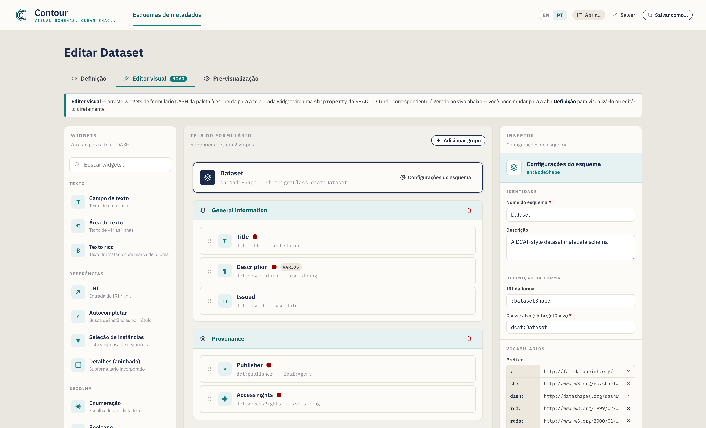

# Creating Metadata Schemas — A Guide for Data Stewards

**Contour** lets you design custom metadata schemas visually —
by dragging or clicking form widgets onto a canvas — and exports them as standards-compliant
[SHACL](https://www.w3.org/TR/shacl/) shapes with [DASH](https://datashapes.org/forms.html)
form annotations. The output drops straight into a
[FAIR Data Point](https://fairdatapoint.org/) or any SHACL-aware platform.

> *Contour's tagline: **Visual schemas. Clean SHACL.***

This guide is written for **data stewards** who want to define what metadata
their community must (or may) provide for a given type of resource — a dataset,
a study, a sample, a software package — without hand-writing Turtle.

> **No installation, no server.** The editor is a single self-contained web page.
> Open it in Chrome or Edge (recommended, for direct file save) — Firefox and
> Safari work too, with a download-style save.

---

## Table of contents

1. [What you are building (key concepts)](#1-what-you-are-building-key-concepts)
2. [The interface at a glance](#2-the-interface-at-a-glance)
3. [Tutorial: build a *Dataset* schema from scratch](#3-tutorial-build-a-dataset-schema-from-scratch)
   - [Step 1 — Define the schema identity](#step-1--define-the-schema-identity)
   - [Step 2 — Manage vocabularies (prefixes)](#step-2--manage-vocabularies-prefixes)
   - [Step 3 — Organise the form into groups](#step-3--organise-the-form-into-groups)
   - [Step 4 — Add your first property (a text field)](#step-4--add-your-first-property-a-text-field)
   - [Step 5 — Set cardinality and validation constraints](#step-5--set-cardinality-and-validation-constraints)
   - [Step 6 — Add a multi-line description](#step-6--add-a-multi-line-description)
   - [Step 7 — Add a date property](#step-7--add-a-date-property)
   - [Step 8 — Add a controlled vocabulary (enumeration)](#step-8--add-a-controlled-vocabulary-enumeration)
   - [Step 9 — Reference another entity (IRI + class)](#step-9--reference-another-entity-iri--class)
   - [Step 10 — Model a sub-object with a nested shape](#step-10--model-a-sub-object-with-a-nested-shape)
   - [Step 11 — Preview the data-entry form](#step-11--preview-the-data-entry-form)
   - [Step 12 — Review the generated SHACL](#step-12--review-the-generated-shacl)
   - [Step 13 — Save and export](#step-13--save-and-export)
4. [Working directly with the code (the SHACL Code tab)](#4-working-directly-with-the-code-the-shacl-code-tab)
   - [Choosing a syntax (and exporting JSON-LD)](#choosing-a-syntax-and-exporting-json-ld)
   - [Editing an existing schema is lossless](#editing-an-existing-schema-is-lossless)
   - [Visualize the graph](#visualize-the-graph)
5. [Checking your work (the Issues panel)](#5-checking-your-work-the-issues-panel)
6. [Power features (advanced modelling)](#6-power-features-advanced-modelling)
7. [Reference](#7-reference)
   - [Widget catalogue](#widget-catalogue)
   - [Property settings reference](#property-settings-reference)
8. [Recipes — common modelling patterns](#8-recipes--common-modelling-patterns)
9. [Tips & troubleshooting](#9-tips--troubleshooting)

---

## 1. What you are building (key concepts)

A metadata schema in this tool is a **SHACL NodeShape**: a description of what a
valid record of a given kind looks like. A few terms you will meet throughout:

| Term | What it means for you |
|---|---|
| **NodeShape** | The schema itself — e.g. "what a Dataset record must contain". |
| **Target class** (`sh:targetClass`) | The RDF type the schema applies to, e.g. `dcat:Dataset`. Records of this type are validated against your schema. |
| **Property** (`sh:property`) | A single field — title, publisher, issue date, … Each property has a *path*, a *widget*, and *constraints*. |
| **Property path** (`sh:path`) | The RDF predicate the field writes to, e.g. `dct:title`. This is the actual term stored in the metadata. |
| **Widget** (`dash:editor`) | The form control shown to the person filling in metadata — a text box, a date picker, a drop-down, etc. |
| **Group** (`sh:PropertyGroup`) | A visual section that bundles related fields, e.g. "General information". |
| **Prefix** (`@prefix`) | A short alias for a vocabulary namespace, e.g. `dct:` → `http://purl.org/dc/terms/`. |

You design all of this visually; the tool writes the SHACL for you.

---

## 2. The interface at a glance

The window has three tabs:

- **SHACL Code** — the serialized schema. Turtle by default, with autocomplete;
  edits sync back to the visual canvas. A **syntax** selector also offers
  N-Triples, TriG, Notation3, and a **JSON-LD** export. This is also where files
  you open are shown.
- **Visual Editor** — the drag-and-drop workbench (shown above). This is where
  most of your work happens.
- **Form Preview** — a realistic rendering of the data-entry form your schema
  produces, so you can test the experience before publishing.

The **Visual Editor** is split into three columns:

| Column | Purpose |
|---|---|
| **Widgets** (left) | The palette of form controls. **Drag** one onto the canvas, or just **click** it (keyboard: focus + Enter) to add it. |
| **Form canvas** (centre) | Your schema: the target banner, groups, properties, and nested shapes. |
| **Inspector** (right) | Settings for whatever is currently selected — the schema, a group, or a property. |

Below the workbench is an **actions bar** with a property/group counter, an
**Issues** indicator (a live check of your schema — see
[§5](#5-checking-your-work-the-issues-panel)), and Save / Copy buttons. To see
the serialized schema, switch to the **SHACL Code** tab; to see the rendered
form, switch to **Form Preview**.

The header holds the file actions — **Undo / Redo**, **New**, **Recent**,
**Examples**, **Open**, **Save**, **Save As** — plus the language toggle and a
**Guide** link:

> **Your work is saved as you go.** Contour keeps an autosaved draft in your
> browser, so a refresh or accidental tab-close won't lose it — you'll see a
> *"Restored your unsaved draft"* notice on return. **Undo/Redo** (or
> Ctrl/Cmd+Z and Ctrl/Cmd+Shift+Z) step through your edits, and the **Recent**
> menu reopens schemas you've saved.

### Interface language

Contour's interface is available in **English** (default) and **Brazilian
Portuguese**. Switch with the **EN / PT** toggle in the header — your choice is
remembered between sessions. Only the interface is translated; your schema
content (names, descriptions, property paths) and the generated SHACL are never
altered, so the exported Turtle is identical in either language.

---

## 3. Tutorial: build a *Dataset* schema from scratch

We will build a [DCAT](https://www.w3.org/TR/vocab-dcat-3/)-style **Dataset**
metadata schema. Each step introduces one feature of the tool, and by the end
you will have touched every major capability.

Contour **starts blank** so you can build your own schema from scratch — the
page title reads *New metadata schema* until you name it. If you'd rather explore
a finished schema, the **Examples** menu in the header loads ready-made
templates (Dataset, Agent, Concept); the *Dataset* example matches what we build
below:

> Throughout, switch to the **Visual Editor** tab to do the work. To begin a
> fresh schema at any time, use the **New** button.

### Step 1 — Define the schema identity

Click the **schema banner** at the top of the canvas (it reads *Untitled schema*
until you name it), or the **Schema settings** button. The Inspector switches to
schema-level settings:

Fill in:

- **Schema name** — a human label, e.g. `Dataset`. (Once set, the page title
  changes from *New metadata schema* to *Edit Dataset*; name it for any domain —
  an ontology class, a catalog — and the title follows.)
- **Description** — a sentence describing the schema's purpose.
- **Shape IRI** — the identifier of the shape, e.g. `:DatasetShape`. The leading
  `:` uses your default namespace; you can leave the suggested value.
- **Target class** (`sh:targetClass`) — the RDF class this schema validates, e.g.
  `dcat:Dataset`. **This is required** for the schema to be useful — it is what
  tells a platform "apply these rules to Dataset records".

### Step 2 — Manage vocabularies (prefixes)

Still in schema settings, scroll to **Vocabularies**. Prefixes let you write
short terms like `dct:title` instead of full URLs.

The editor ships with the common ones already declared — `sh`, `dash`, `rdf`,
`rdfs`, `xsd`, `dcat`, `dct`, `foaf`, and the default empty prefix `:`. To add
your own (for example a domain vocabulary):

1. In the empty row at the bottom of the prefix table, type the **alias** (e.g.
   `vcard`) in the first box.
2. Type the **namespace URL** (e.g. `http://www.w3.org/2006/vcard/ns#`) in the
   second box.
3. Press **Enter** or click the **+** button.

Remove a prefix with the **×** next to it. Any prefix you use in a property path
or class should be declared here so the exported Turtle is valid.

### Step 3 — Organise the form into groups

Groups (`sh:PropertyGroup`) are the sections of your form. On a blank canvas you
can simply **drag your first widget onto the canvas** and Contour creates the
first group for you — or click **Add group** (top-right of the canvas) to make an
empty section to drop into:

- **Rename** a group by clicking its title and typing — e.g. `General information`.
- **Reorder** with the **↑ / ↓** buttons on the group header (this renumbers the
  groups for you).
- **Delete** with the trash icon on the group header.

For this tutorial, create two groups: **General information** and **Provenance**.

### Step 4 — Add your first property (a text field)

From the **Widgets** palette on the left, add a **Text field** to the *General
information* group — either **drag** it onto the group, or simply **click** it
(it's added to the selected group, or the last one). Keyboard users can focus a
widget and press **Enter**. Widgets are organised by category (Text, References,
Choice, Date & number) and searchable via the box at the top.

When you add a widget, it becomes a property card on the canvas and is selected
automatically. A property card shows its label, path, type, and status badges
(a red dot for required, a "multi" badge for repeatable):

Each card has handles to **drag-reorder** (the grip on the left), **duplicate**,
and **delete** (the icons on the right, on hover).

With the new field selected, the Inspector shows its **Property settings**. Set:

- **Label (`sh:name`)** → `Title` — the field label shown to users.
- **Description** → optional help text (appears as an ⓘ tooltip on the form).
- **Property path (`sh:path`)** → `dct:title` — **the RDF term this field writes**.
  Always set this; the default placeholder path is not meaningful. As you type,
  Contour suggests common predicates (and your declared prefixes); pick one or
  keep typing your own.

### Step 5 — Set cardinality and validation constraints

The **Constraints** section of the Inspector controls validation. For *Title*:

- **Min count** = `1`, **Max count** = `1` → exactly one title is required.
  (Min count ≥ 1 makes the field required — note the red dot on the card and the
  red asterisk in the form preview.)
- **Node kind** = `sh:Literal` (a plain value rather than a link).
- **Datatype** = `xsd:string`.
- Optionally **Min/Max length** and a **Pattern** (a regular expression, e.g.
  `^[A-Z].*` to require an initial capital).

> **Cardinality cheat-sheet:** *Min 1 / Max 1* = required, single value.
> *Min 0 / Max 1* = optional, single value. *Min 1 / Max ∞* (leave Max empty) =
> required, repeatable. *Min 0 / Max ∞* = optional, repeatable.

**Value range** (numbers and dates). Number, Date, and Date & time fields show a
**Value range** section — set **Min (≥)** / **Max (≤)** (inclusive) or the
**(>)** / **(<)** exclusive bounds. Numbers are written bare
(`sh:minInclusive 1900`), dates as typed literals (`"2020-01-01"^^xsd:date`).

**Custom validation message** (optional). The **Validation message** section
lets you set the text a platform shows when this field fails (`sh:message`) and
its **Severity** — *Violation* (default), *Warning*, or *Info* (`sh:severity`).

### Step 6 — Add a multi-line description

Drag a **Text area** into *General information*. Set:

- **Label** → `Description`, **Path** → `dct:description`.
- **Min count** = `1`, leave **Max count** empty (∞) so multiple
  language variants can be provided. The card now shows a **multi** badge, and
  the form preview gains a **+ Add** button.

### Step 7 — Add a date property

Drag a **Date picker** into *General information*. Set:

- **Label** → `Issued`, **Path** → `dct:issued`.
- **Min count** = `0`, **Max count** = `1` (optional, single).
- The datatype defaults to `xsd:date`, which is correct for a calendar date.
  (Use **Date & time** instead if you need a timestamp — `xsd:dateTime`.)

### Step 8 — Add a controlled vocabulary (enumeration)

Switch to the *Provenance* group and drag an **Enumeration** widget in. This
creates a drop-down restricted to a fixed list of values (`sh:in`).

In the Inspector, an **Allowed values** editor appears:

- **Label** → `Access rights`, **Path** → `dct:accessRights`.
- In **Allowed values**, type each option and press **Enter**: `public`,
  `restricted`, `private`. Remove one with its **×**.
- Min/Max count `1`/`1` to require exactly one choice.

The values are exported as `sh:in ( "public" "restricted" "private" )`.

> **Literal vs. IRI values.** Each allowed value carries a **literal / IRI**
> toggle (the small tag to its left). Keep it **literal** for plain text like
> `public`; switch it to **IRI** when the choices are controlled-vocabulary terms
> (e.g. `ex:Public`, a `skos:Concept`) so they export as IRIs, not strings.

### Step 9 — Reference another entity (IRI + class)

Some properties point to *another resource* rather than holding a plain value —
for example the dataset's **publisher** is an organisation, not a string. Drag an
**Auto-complete** widget into *Provenance*. This renders a search box that looks
up existing instances.

- **Label** → `Publisher`, **Path** → `dct:publisher`.
- **Node kind** = `sh:IRI` (the value is a link/identifier).
- **Class (`sh:class`)** → `foaf:Agent` — restricts the picker to instances of
  that class. (The **Class** box only appears when the node kind is IRI-based.)
- Min/Max count `1`/`1`.

> Other reference widgets: **URI** (free-form link), **Instances select** (a
> drop-down of instances). Use whichever fits how the value is chosen. The
> **Class** box suggests common classes as you type.

> **Advanced:** a property can also accept *either* a literal *or* an IRI (and
> similar "one of these types" rules) via **Alternative value types (`sh:or`)**,
> or follow a relationship backwards with an **Inverse (`^`)** path — see
> [§6 Power features](#6-power-features-advanced-modelling).

### Step 10 — Model a sub-object with a nested shape

Sometimes a field is itself a small structured object. A **contact point**, for
instance, has its own *name* and *email*. Model this with a **nested shape** and
the **Details (nested)** widget.

1. At the bottom of the canvas, click **Add nested shape**. A new shape appears
   under the *Nested shapes* divider and is selected. In the Inspector set its
   **Shape IRI** (e.g. `:ContactShape`) and optionally a **Target class** (e.g.
   `vcard:Kind`). *Renaming the IRI automatically updates every property that
   references it.*
2. **Drag widgets onto the nested shape** just like a group — e.g. a **Text
   field** `Full name` (`vcard:fn`) and a **URI** `Email` (`vcard:hasEmail`).
3. Back in a group, add a **Details (nested)** widget. In its Inspector, set
   **Nested shape (`sh:node`)** to `:ContactShape` (the box offers your nested
   shapes as suggestions).

> **Shortcut.** On a **Details** property you can click **Create & link nested
> shape** to mint a new shape and wire `sh:node` to it in one step — then just
> add its fields. The property card shows the link it points to (e.g.
> `→ :ContactShape`), and the [Issues panel](#5-checking-your-work-the-issues-panel)
> flags a Details property whose target is missing.

The Details property's Inspector links it to the nested shape via `sh:node`:

The nested shape card on the canvas holds its own properties:

### Step 11 — Preview the data-entry form

At any point, open the **Form Preview** tab to check what the person entering
metadata will see. The preview mirrors your constraints: required fields show a
red asterisk, a small **cardinality** chip shows the allowed count (e.g. `1–3`),
descriptions become ⓘ tooltips, repeatable fields get **+ Add** buttons,
patterns / lengths / ranges are applied to the inputs, language-tagged text
gets a small language box, any **validation message** appears under the field,
and **Details** properties render their nested shape's fields inline — nesting
to any depth:

This preview is read-only — it is there to validate the design, not to capture
real data.

### Step 12 — Review the generated SHACL

The **SHACL Code** tab shows the Turtle generated from your design (and lets you
edit it directly):

Everything you configured visually is here — `@prefix` declarations, the
`PropertyGroup`s, the `NodeShape` with its `sh:property` blocks, and any nested
shapes. The **Copy SHACL** button in the Visual Editor's actions bar puts the
serialization on your clipboard. Use the **Syntax** selector to view or export
other formats, including JSON-LD (see [§4](#4-working-directly-with-the-code-the-shacl-code-tab)).

### Step 13 — Save and export

Save your schema (a `.ttl` file by default):

- **Save As…** — choose a new file name and location. The extension follows the
  selected syntax (`.ttl`, `.nt`, `.trig`, `.n3`, or `.jsonld`).
- **Save** — write back to the file you last opened/saved (Ctrl/Cmd+S). The
  button briefly shows **Saved!** to confirm.
- **Copy SHACL** — copy the current serialization without saving a file.
- **Recent** (header) — reopen a schema you saved earlier this session.

> In Chrome/Edge the file is written directly to disk. In Firefox/Safari the
> editor falls back to a normal download. The suggested file name is derived from
> the schema name (e.g. `dataset.ttl`). Either way, an autosaved draft is kept in
> your browser between sessions.

Upload the resulting `.ttl` to your FAIR Data Point (or other SHACL platform) as
a metadata schema, and records of the target class will be validated — and forms
rendered — according to your design.

---

## 4. Working directly with the code (the SHACL Code tab)

Prefer to write or paste SHACL by hand, or need to start from an existing shape?
Use the **SHACL Code** tab.

- **Two-way sync.** Edits to the Turtle are parsed and pushed back to the Visual
  Editor automatically (after you pause typing). Conversely, anything you build
  visually appears here.
- **Context-aware autocomplete** (Turtle). As you type, the editor suggests SHACL
  predicates, node kinds, XSD datatypes, DASH editors, declared property groups,
  and `@prefix` lines. Use **↑/↓** to move, **Tab**/**Enter** to accept,
  **Esc** to dismiss.

- **Open an existing file.** **Open…** in the header loads a `.ttl`/`.nt`/
  `.trig`/`.n3` file into this tab, detects its syntax, and parses it into the
  Visual Editor — a fast way to adapt an existing schema. If a file can't be
  parsed, an inline message points to the problem line; you can still edit the
  raw text.
- **Name & Description** for the schema also have plain inputs at the top of this
  tab.

Click **Open in Visual Editor** to jump back to the drag-and-drop view.

### Choosing a syntax (and exporting JSON-LD)

A **Syntax** selector in this tab switches the serialization between **Turtle**
(default), **N-Triples**, **TriG**, **Notation3**, and **JSON-LD (export)**. The
first four are fully editable — edits sync back. **JSON-LD is export-only**
(there's no JSON-LD parser): the editor shows it read-only so you can **Copy** it
or **Save As** a `.jsonld` file, then switch back to Turtle to keep editing.

New schemas always start as Turtle, and **Save As** uses the extension that
matches the selected syntax.

### Editing an existing schema is lossless

Contour parses files with a real RDF engine, so opening, editing, and saving a
schema **never silently drops the parts it doesn't visually model**. Constructs
the editor doesn't have a control for — say `sh:and`, qualified value shapes, or
extra annotations — are **preserved verbatim** and re-emitted in a clearly
commented *"Preserved"* block at the end of the output. When a loaded file
contains such constructs you'll see a short notice in this tab; your edits to the
parts Contour *does* model are applied as usual, and the rest round-trips intact.

### Visualize the graph

Click **Graph** in this tab to open a node-link visualization of the schema's
RDF in an overlay — shapes, property nodes, classes, and literals, linked by
their predicates. Scroll to zoom, drag the background to pan, and drag a node to
reposition it. It's a quick way to see the structure (and any nested shapes or
preserved constructs) at a glance.

---

## 5. Checking your work (the Issues panel)

As you build, Contour continuously checks the schema and summarizes problems in
the **Issues** indicator on the Visual Editor's actions bar. Click it to expand
the list; click any item to jump straight to the offending element.

It flags things like:

- a property with **no path**, or **duplicate paths** in the same group;
- a **Details** property whose nested shape is **missing**;
- a path, class, datatype, or target class using a **prefix you haven't
  declared**;
- a missing **target class** or schema **name**;
- nested shapes with a missing or duplicate IRI.

Issues are **non-blocking** — they're guidance, not gates — but clearing them
means the exported SHACL is well-formed and references only declared vocabularies.

---

## 6. Power features (advanced modelling)

Beyond the core widgets and constraints, the Inspector exposes a few advanced
controls for richer schemas. Each is optional — reach for them when your model
needs them.

### Labels in multiple languages

`sh:name` and `sh:description` can carry a **language tag**, and you can add
**translations** so one field is labelled in several languages. In the **Basic**
section, type a tag (e.g. `en`) in the small box beside the label; a
**translations** editor then lets you add more (`pt` → "Título", …). Each becomes
its own language-tagged statement (`sh:name "Title"@en, "Título"@pt`), and the
form preview shows a language box on the field.

### Numeric & date ranges

Number, Date, and Date & time fields show a **Value range** block in
**Constraints**. Set inclusive **Min (≥)** / **Max (≤)** or exclusive **(>)** /
**(<)** bounds — e.g. a publication year ≥ 1900. Numbers export bare
(`sh:minInclusive 1900`); dates as typed literals (`"2000-01-01"^^xsd:date`).

### Custom validation messages

The **Validation message** section sets the text a platform shows when a value
fails the rule (`sh:message`) and its **Severity** — *Violation* (default),
*Warning*, or *Info* (`sh:severity`). Use it to turn a bare failure into
steward-friendly guidance.

### Alternative value types (literal *or* IRI)

Some properties legitimately accept more than one kind of value — a subject that
may be free text *or* a controlled-vocabulary IRI, say. Click **Allow alternative
value types (`sh:or`)** and list the branches (each a node kind, datatype, or
class). It exports as `sh:or ( [ … ] [ … ] )`. Richer logical shapes Contour
doesn't model are still preserved on round-trip (see
[§4](#4-working-directly-with-the-code-the-shacl-code-tab)).

### Inverse paths

Tick **Inverse (`^`)** next to the property path to match a relationship
*backwards* — "resources that point at this one" rather than the other way
round. It exports as `sh:path [ sh:inversePath … ]`, and the property card shows
the path with a leading `^`.

---

## 7. Reference

### Widget catalogue

Every widget maps to a DASH editor and sensible default node kind / datatype.

| Widget | DASH editor | Typical use | Defaults |
|---|---|---|---|
| **Text field** | `dash:TextFieldEditor` | Single-line text | `sh:Literal`, `xsd:string` |
| **Text area** | `dash:TextAreaEditor` | Multi-line text | `sh:Literal`, `xsd:string` |
| **Rich text** | `dash:RichTextEditor` | Formatted text with language tag | `sh:Literal`, `rdf:HTML` |
| **URI** | `dash:URIEditor` | Free-form link / IRI | `sh:IRI` |
| **Auto-complete** | `dash:AutoCompleteEditor` | Look up an instance by label | `sh:IRI`, `sh:class foaf:Agent` |
| **Instances select** | `dash:InstancesSelectEditor` | Drop-down of instances | `sh:IRI` |
| **Details (nested)** | `dash:DetailsEditor` | Embedded sub-form via a nested shape | `sh:BlankNodeOrIRI` |
| **Enumeration** | `dash:EnumSelectEditor` | Choice from a fixed `sh:in` list | `sh:Literal`, `xsd:string` |
| **Boolean** | `dash:BooleanSelectEditor` | true / false | `sh:Literal`, `xsd:boolean` |
| **Date picker** | `dash:DatePickerEditor` | Calendar date | `sh:Literal`, `xsd:date` |
| **Date & time** | `dash:DateTimePickerEditor` | Timestamp | `sh:Literal`, `xsd:dateTime` |
| **Number** | `dash:NumberFieldEditor` | Numeric value | `sh:Literal`, `xsd:integer` |

Defaults are starting points — override the node kind, datatype, or class in the
Inspector whenever your model needs something different.

### Property settings reference

What each Inspector control writes into SHACL:

| Inspector field | SHACL output | Notes |
|---|---|---|
| Label | `sh:name` | The form label. Optional **language tag** + additional **translations** emit one `sh:name` per language. |
| Description | `sh:description` | Help text / ⓘ tooltip. Also language-taggable, with translations. |
| Property path | `sh:path` | **Required.** The RDF predicate. **Inverse (`^`)** emits `[ sh:inversePath … ]`. |
| Min count | `sh:minCount` | ≥ 1 makes the field required. |
| Max count | `sh:maxCount` | Empty = unbounded (repeatable). |
| Node kind | `sh:nodeKind` | `sh:Literal`, `sh:IRI`, `sh:BlankNode`, or combinations. |
| Datatype | `sh:datatype` | Shown for literal node kinds. |
| Class | `sh:class` | Shown for IRI node kinds; restricts the target type. |
| Nested shape | `sh:node` | Shown for **Details**; links to a nested shape. |
| Min / Max length | `sh:minLength` / `sh:maxLength` | Literals only. |
| Value range | `sh:minInclusive` / `maxInclusive` / `minExclusive` / `maxExclusive` | Numbers & dates. |
| Pattern (regex) | `sh:pattern` | Literals only. |
| Allowed values | `sh:in ( … )` | Enumeration choices; each value literal or IRI. |
| Alternative value types | `sh:or ( … )` | "Accept one of these types" (e.g. literal **or** IRI). |
| Message / Severity | `sh:message` / `sh:severity` | Custom validation text + Violation / Warning / Info. |
| Default value | `sh:defaultValue` | Pre-filled value. |
| Order | `sh:order` | Field order within its group. |

Schema- and group-level controls:

| Control | SHACL output |
|---|---|
| Schema name | `rdfs:label` on the NodeShape |
| Shape IRI | the NodeShape subject |
| Target class | `sh:targetClass` |
| Prefixes | `@prefix` declarations |
| Group label | `rdfs:label` on the `sh:PropertyGroup` |
| Group order | `sh:order` on the group; field's `sh:group` links it |

---

## 8. Recipes — common modelling patterns

Short, self-contained patterns you can apply on top of the tutorial.

**Make a field required.** Set **Min count** to `1`. The card shows a red dot and
the form marks it with `*`.

**Allow multiple values.** Leave **Max count** empty (∞). The card shows a
**multi** badge and the form gains **+ Add**.

**Restrict to a fixed list.** Use the **Enumeration** widget and fill in
**Allowed values**. Exports as `sh:in`.

**Link to an organisation or person.** Use **Auto-complete** (or **Instances
select**), node kind `sh:IRI`, and **Class** = `foaf:Agent` (or your chosen
class).

**Capture a structured sub-object** (address, contact point, distribution).
Create a **nested shape**, add its fields, then point a **Details (nested)**
property at it via `sh:node`. See [Step 10](#step-10--model-a-sub-object-with-a-nested-shape).

**Enforce a format.** For literals, set a **Pattern** (regex) and/or **Min/Max
length** — e.g. an ORCID pattern, or a max length on a code field.

**Bound a number or date.** On a Number / Date field, use the **Value range**
section — e.g. *Min (≥)* `1900` for a year, or *Max (≤)* a cut-off date.

**Offer a label in several languages.** Set a **language tag** on the **Label**
(e.g. `en`) and add **translations** (`pt` → "Título", …). Each becomes a
language-tagged `sh:name`, and the form preview shows a language box.

**Accept a literal *or* an IRI** (or "one of these types"). Use **Alternative
value types (`sh:or`)** on the property and list the branches (e.g.
`sh:nodeKind sh:Literal` and `sh:nodeKind sh:IRI`). Common in DCAT-AP for values
that may be inline text or a reference.

**Follow a relationship backwards.** Tick **Inverse (`^`)** on the path to match
"things that point at this resource" (e.g. members of a collection) — exported
as `[ sh:inversePath … ]`.

**Explain a validation rule.** Fill the **Validation message** with steward-
friendly text and pick a **Severity** so a platform can show a helpful Warning
instead of a bare failure.

**Export to JSON-LD.** In the SHACL Code tab, set **Syntax** → *JSON-LD
(export)* and **Copy** or **Save As** `.jsonld` for tools that consume JSON-LD.

**Start from an example.** Use the **Examples** menu to load a Dataset (DCAT),
Agent (FOAF), or Concept (SKOS) template, then adapt it to your needs.

**Reuse an existing schema.** **Open…** the existing file, adapt it in the
Visual Editor, then **Save As…** a new file — anything Contour doesn't model is
preserved (see [§4](#4-working-directly-with-the-code-the-shacl-code-tab)).

---

## 9. Tips & troubleshooting

- **Always set the property path.** New widgets get a placeholder path like
  `:textfield`; replace it with the real RDF term (`dct:title`, `dcat:theme`, …)
  or the exported metadata won't use the term you intend.
- **Declare the prefixes you use.** If a path or class uses an alias (e.g.
  `vcard:`), add it under **Vocabularies** so the Turtle is valid.
- **A field went to the wrong group.** Drag the property card into the correct
  group; the **Group** box in the Inspector is read-only and reflects the move.
- **SHACL Code edits didn't sync.** Syncing happens shortly after you stop
  typing. If a parse error is shown (with a line number), fix the Turtle — the
  visual canvas keeps the last valid state until the text parses.
- **Save button only downloads.** That's the expected fallback in Firefox/Safari.
  For in-place saves, use a Chromium-based browser (Chrome/Edge).
- **Made a mistake?** **Undo** (Ctrl/Cmd+Z) / **Redo** (Ctrl/Cmd+Shift+Z) cover
  every edit, and your work is autosaved — a refresh restores it.
- **Check the Issues panel.** Before exporting, expand **Issues** in the actions
  bar and clear any errors (empty paths, undeclared prefixes, broken `sh:node`).
- **Editing JSON-LD?** You can't — it's export-only. Switch **Syntax** back to
  Turtle (or N-Triples / TriG / N3) to keep editing.
- **Start over.** Use the **New** button for a blank schema, load one from
  **Examples**, or **Open…** an existing file.

---

*Built with Contour for the FAIR Data Point ecosystem. Output is
standard SHACL + DASH and works with any SHACL-aware tooling.*
